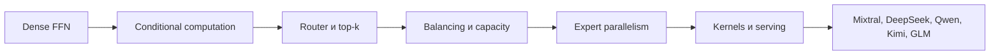

# Mixture of Experts: карта модуля и источники

MoE — совместная задача conditional computation, оптимизации router,
балансировки нагрузки, распределённого выполнения и serving. Формула «несколько
FFN плюс router» годится как первый кадр, но не как объяснение технологии.

## Двенадцать уроков

| № | Урок | Что должен увидеть читатель |
|---|---|---|
| 1 | Dense FFN, GLU и SwiGLU | shapes, параметры и FLOPs внутри decoder block |
| 2 | Conditional computation | total и active parameters — разные величины |
| 3 | Router и top-k | logits → probabilities → dispatch → weighted merge |
| 4 | Top-1, top-2, expert-choice | разные token/expert assignments на одном batch |
| 5 | Balancing и z-loss | entropy, expert load, collapse и auxiliary objective |
| 6 | Capacity, overflow и dropless | dropped tokens против padding и block-sparse kernels |
| 7 | Shared и fine-grained experts | архитектурная мотивация DeepSeekMoE |
| 8 | Специализация | probes и routing heatmaps вместо антропоморфных названий |
| 9 | Expert parallelism | token permutation и all-to-all между устройствами |
| 10 | Kernels | Python loop, grouped GEMM и GPU utilization |
| 11 | Serving | VRAM, placement, batching, TTFT и ITL |
| 12 | Семейства | disclosure matrix и честное сравнение моделей |

## Педагогический каркас

- [Hugging Face: Mixture of Experts Explained](https://huggingface.co/blog/moe) —
  noisy top-k, balancing, capacity, specialization, parallelism и serving.
- [Stanford CME295, Lecture 3](https://cme295.stanford.edu/slides/fall25-cme295-lecture3.pdf) —
  чистая первая схема router → experts → merge.
- [Stanford CS231N 2026, Lecture 8](https://cs231n.stanford.edu/slides/2026/lecture_8.pdf) —
  ясное различие total experts `E` и active experts `A`.
- [Stanford CS336 2026, Lecture 4](https://cs336.stanford.edu/) — строгий
  современный разбор mechanism и architecture trade-offs.

## Первичные papers: читать в этом порядке

| Источник | Что добавляет к предыдущему |
|---|---|
| [Sparsely-Gated MoE](https://arxiv.org/abs/1701.06538) | sparse conditional computation, noisy top-k и balancing |
| [GShard](https://arxiv.org/abs/2006.16668) | top-2, expert capacity и distributed scaling |
| [Switch Transformer](https://arxiv.org/abs/2101.03961) | top-1, более простой communication path и token dropping |
| [ST-MoE](https://arxiv.org/abs/2202.08906) | router z-loss, stability и fine-tuning |
| [MegaBlocks](https://arxiv.org/abs/2211.15841) | dropless MoE через block-sparse operations |
| [DeepSeekMoE](https://arxiv.org/abs/2401.06066) | fine-grained и shared experts |
| [OLMoE](https://arxiv.org/abs/2409.02060) | открытые training artifacts для dynamics и specialization |
| [DeepSeek-V3](https://arxiv.org/abs/2412.19437) | auxiliary-loss-free balancing, layout и training systems |

## Код и systems

- [MegaBlocks](https://github.com/stanford-futuredata/megablocks) — связь
  routing imbalance с block-sparse GPU execution.
- [Megatron Core MoE guide](https://github.com/NVIDIA/Megatron-LM/blob/main/megatron/core/transformer/moe/README.md) —
  dispatchers, token permutation, EP/TP/DP и современные model recipes.
- [DeepSpeed MoE tutorial](https://www.deepspeed.ai/tutorials/mixture-of-experts/) —
  более простой первый distributed lab; API всегда сверяется с текущей версией.
- [CS231N 2026, Lecture 11](https://cs231n.stanford.edu/slides/2026/lecture_11.pdf) —
  expert parallelism рядом с DP/TP/PP/CP.
- [HF: MoEs in Transformers, 2026](https://huggingface.co/blog/moe-transformers) —
  weight layout, eager/batched/grouped backends и expert parallelism.
- [Berkeley Scalable AI 2026](https://scalable-ai.eecs.berkeley.edu/) — profiling
  и scaling bottlenecks.

## Обязательный интерактив

Toy batch из 12 tokens проходит через router. Читатель переключает top-1/top-2,
capacity factor и shared expert; видит router probabilities, очереди experts,
overflow, entropy, load imbalance, auxiliary loss и tensors, уходящие в
all-to-all. Рядом считаются total parameters, active parameters, FLOPs и memory.

## Семейства для case studies

| Семейство | Фокус | Primary/official |
|---|---|---|
| Mixtral | top-2 и active parameter accounting | [paper](https://arxiv.org/abs/2401.04088) |
| DeepSeek | shared/fine-grained experts, balancing, systems | [V2](https://arxiv.org/abs/2405.04434), [V3](https://arxiv.org/abs/2412.19437) |
| Qwen | dense/MoE линейки и thinking modes | [Qwen3](https://arxiv.org/abs/2505.09388) |
| Kimi | large-scale MoE и training recipe | [Kimi K2](https://github.com/MoonshotAI/Kimi-K2) |
| GLM | MoE с agentic/reasoning post-training | [GLM-4.5](https://github.com/zai-org/GLM-4.5) |
| DBRX | fine-grained MoE, более слабый disclosure | [official](https://www.databricks.com/blog/introducing-dbrx-new-state-art-open-llm) |

## Quality gate

Читатель должен объяснить, почему active parameters, FLOPs и VRAM не
взаимозаменяемы; как balancing objective взаимодействует с LM loss; когда
capacity приводит к token dropping; почему «expert» не гарантирует семантическую
специализацию; и почему MoE speedup зависит от batch, kernels и topology.

Текущая связная глава: [[02 Areas/ML & DL/00 Учебник/09 Dense FFN и Mixture of Experts/01 От SwiGLU к MoE]].
