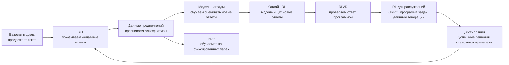

# Посттренинг: от продолжения текста к управляемому поведению

Посттренинг нельзя понять, просто выучив расшифровки SFT, RLHF, DPO и GRPO.
Каждый следующий метод появляется потому, что предыдущий оставляет нерешённую
задачу. SFT показывает модели хорошие ответы, но не объясняет, как сравнивать
несколько правдоподобных вариантов. Данные предпочтений дают такие сравнения,
но сами по себе ещё не позволяют искать новые ответы. Модель награды и обучение
с подкреплением создают этот поисковый контур, а проверяемые награды заменяют
субъективного оценщика там, где правильность можно установить программой.

## Порядок чтения

1. **SFT и инструктивные данные** — как диалог превращается в токены и метки,
   по каким позициям считается функция потерь и почему состав данных важнее
   названия библиотеки обучения.
2. **Данные предпочтений и модель награды** — как собирают сравнения, какие
   предположения делает модель Брэдли—Терри и почему награда остаётся лишь
   приближением человеческой оценки.
3. **Градиент стратегии и PPO для LLM** — от вероятности целого ответа к
   REINFORCE, базовой линии, преимуществу, GAE, ограничению шага и KL.
4. **DPO** — вывод функции потерь, направление обновления, роль опорной модели и
   пределы обучения на фиксированных предпочтениях.
5. **RLVR и верификаторы** — разбор ответа, программная проверка, устройство
   награды, последовательность усложнения задач и взлом критерия.
6. **GRPO и DeepSeek-R1** — сравнение ответов внутри группы, способы
   нормировки, различие R1-Zero и полного многоэтапного обучения R1.
7. **Дистилляция рассуждений** — генерация, проверка, отбор и SFT, а также
   различие между копированием успешных ответов и переносом внутреннего алгоритма.

## Основной учебный каркас

| Блок | Основное объяснение | Практика | Первоисточники |
|---|---|---|---|
| Общая карта | [Karpathy: Deep Dive into LLMs](https://www.youtube.com/watch?v=7xTGNNLPyMI), [Stanford CS336](https://cs336.stanford.edu/) | [DeepLearning.AI: Post-training of LLMs](https://www.deeplearning.ai/courses/post-training-of-llms/) | InstructGPT, T0/FLAN |
| SFT | [CS336 Lecture 15](https://cs336.stanford.edu/spring2025/), [RLHF Book](https://rlhfbook.com/) | [CS336 Assignment 5](https://github.com/stanford-cs336/assignment5-alignment), [Open Instruct](https://github.com/allenai/open-instruct) | [T0](https://arxiv.org/abs/2110.08207), [FLAN](https://arxiv.org/abs/2109.01652), [InstructGPT](https://arxiv.org/abs/2203.02155) |
| Формат диалога и маскирование | [Hugging Face: Chat templates](https://huggingface.co/blog/chat-templates) | [TRL chat templates](https://huggingface.co/docs/trl/chat_templates) | конфигурация токенизатора конкретной модели |
| Preferences | [RLHF Book: Preference data](https://rlhfbook.com/) | [UltraFeedback](https://huggingface.co/datasets/openbmb/UltraFeedback) | InstructGPT, Anthropic HH, Constitutional AI |
| Reward models | [RLHF Book: Reward Modeling](https://rlhfbook.com/c/05-reward-models) | [TRL RewardTrainer](https://huggingface.co/docs/trl/reward_trainer) | Bradley–Terry, InstructGPT, RewardBench |
| Policy gradient/PPO | [OpenAI Spinning Up: Policy Gradient](https://spinningup.openai.com/en/latest/spinningup/rl_intro3.html), [PPO](https://spinningup.openai.com/en/latest/algorithms/ppo.html) | [The N Implementation Details of RLHF with PPO](https://huggingface.co/blog/the_n_implementation_details_of_rlhf_with_ppo) | [REINFORCE](https://link.springer.com/article/10.1007/BF00992696), [PPO](https://arxiv.org/abs/1707.06347) |
| DPO | [RLHF Book: Direct Alignment](https://rlhfbook.com/) | [TRL DPOTrainer](https://huggingface.co/docs/trl/dpo_trainer), [Alignment Handbook](https://github.com/huggingface/alignment-handbook) | [DPO](https://arxiv.org/abs/2305.18290) |
| RLVR/GRPO | [CS336 Lecture 16](https://cs336.stanford.edu/spring2025/), RLHF Book course | [Open R1](https://github.com/huggingface/open-r1), [verl](https://github.com/volcengine/verl) | [DeepSeekMath](https://arxiv.org/abs/2402.03300), [DeepSeek-R1](https://arxiv.org/abs/2501.12948) |
| Distillation | RLHF Book, Open R1 documentation | Open R1 generation/SFT recipes | DeepSeek-R1, sequence-level knowledge distillation |

## Как используются источники

Источники играют разные роли, и их нельзя заменять друг другом:

- **курс или хорошая статья** задаёт порядок объяснения и интуицию;
- **научная статья** фиксирует точное утверждение, функцию обучения и условия
  эксперимента;
- **код** показывает детали, которые статья часто опускает: маски, способ
  усреднения, заполнение последовательностей, старые логарифмы вероятностей,
  синхронизацию и метрики;
- **иллюстрация** используется только там, где она объясняет механизм лучше текста;
- **наша глава** соединяет всё это одним примером и явно отмечает, где
  заканчивается установленный результат и начинается практическая эвристика.

## Когда урок можно считать законченным

Урок не считается готовым, пока читатель не может:

1. объяснить, какую проблему решает метод и почему предыдущего этапа мало;
2. вручную провести небольшой пример от исходной записи до функции потерь;
3. прочитать формулу обучения словами и объяснить роль каждого слагаемого;
4. сопоставить формулу с минимальным кодом;
5. назвать хотя бы три режима отказа и увидеть их в метриках;
6. отличить утверждения первоисточника от более широких интерпретаций;
7. выполнить небольшой эксперимент и проверить ожидаемый результат;
8. перейти к первоисточнику, конкретной лекции и рабочей реализации.

Короткое определение может оставаться в справочнике. В учебнике оно допустимо
только как итог уже проведённого рассуждения.
