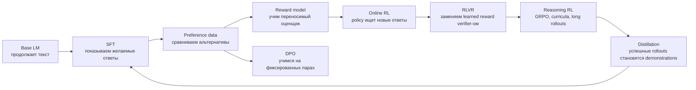

# Post-training: карта модуля и источники

Post-training нельзя понять как словарь из SFT, RLHF, DPO и GRPO. Это цепочка
задач, каждая из которых появляется из ограничения предыдущей:

## Порядок чтения

1. **SFT и instruction data** — как conversation становится token sequence,
   где считается loss и почему data recipe важнее названия trainer.
2. **Preference data и reward modeling** — как собирают comparisons, что
   предполагает Bradley–Terry model и как reward превращается в опасный proxy.
3. **Policy gradient и PPO для LLM** — от sequence probability до REINFORCE,
   baseline, advantage, GAE, clipping и KL.
4. **DPO и direct preference optimization** — полный вывод objective, геометрия
   update, роль reference policy и пределы offline preference learning.
5. **RLVR и verifiers** — parser, verifier, reward design, curricula и hacking.
6. **GRPO и DeepSeek-R1** — group-relative baseline, варианты normalization,
   R1-Zero и полный многоэтапный R1 recipe.
7. **Reasoning distillation** — generation, verification, selection, SFT и
   различие между переносом outputs и переносом алгоритма.

## Основной учебный каркас

| Блок | Основное объяснение | Практика | Первоисточники |
|---|---|---|---|
| Общая карта | [Karpathy: Deep Dive into LLMs](https://www.youtube.com/watch?v=7xTGNNLPyMI), [Stanford CS336](https://cs336.stanford.edu/) | [DeepLearning.AI: Post-training of LLMs](https://www.deeplearning.ai/courses/post-training-of-llms/) | InstructGPT, T0/FLAN |
| SFT | [CS336 Lecture 15](https://cs336.stanford.edu/spring2025/), [RLHF Book](https://rlhfbook.com/) | [CS336 Assignment 5](https://github.com/stanford-cs336/assignment5-alignment), [Open Instruct](https://github.com/allenai/open-instruct) | [T0](https://arxiv.org/abs/2110.08207), [FLAN](https://arxiv.org/abs/2109.01652), [InstructGPT](https://arxiv.org/abs/2203.02155) |
| Chat format и masking | [Hugging Face: Chat templates](https://huggingface.co/blog/chat-templates) | [TRL chat templates](https://huggingface.co/docs/trl/chat_templates) | model-specific tokenizer configs |
| Preferences | [RLHF Book: Preference data](https://rlhfbook.com/) | [UltraFeedback](https://huggingface.co/datasets/openbmb/UltraFeedback) | InstructGPT, Anthropic HH, Constitutional AI |
| Reward models | [RLHF Book: Reward Modeling](https://rlhfbook.com/c/05-reward-models) | [TRL RewardTrainer](https://huggingface.co/docs/trl/reward_trainer) | Bradley–Terry, InstructGPT, RewardBench |
| Policy gradient/PPO | [OpenAI Spinning Up: Policy Gradient](https://spinningup.openai.com/en/latest/spinningup/rl_intro3.html), [PPO](https://spinningup.openai.com/en/latest/algorithms/ppo.html) | [The N Implementation Details of RLHF with PPO](https://huggingface.co/blog/the_n_implementation_details_of_rlhf_with_ppo) | [REINFORCE](https://link.springer.com/article/10.1007/BF00992696), [PPO](https://arxiv.org/abs/1707.06347) |
| DPO | [RLHF Book: Direct Alignment](https://rlhfbook.com/) | [TRL DPOTrainer](https://huggingface.co/docs/trl/dpo_trainer), [Alignment Handbook](https://github.com/huggingface/alignment-handbook) | [DPO](https://arxiv.org/abs/2305.18290) |
| RLVR/GRPO | [CS336 Lecture 16](https://cs336.stanford.edu/spring2025/), RLHF Book course | [Open R1](https://github.com/huggingface/open-r1), [verl](https://github.com/volcengine/verl) | [DeepSeekMath](https://arxiv.org/abs/2402.03300), [DeepSeek-R1](https://arxiv.org/abs/2501.12948) |
| Distillation | RLHF Book, Open R1 documentation | Open R1 generation/SFT recipes | DeepSeek-R1, sequence-level knowledge distillation |

## Как используются источники

Источники играют разные роли, и их нельзя заменять друг другом:

- **курс или хорошая статья** задаёт порядок объяснения и интуицию;
- **paper** фиксирует точный claim, objective и экспериментальные условия;
- **код** показывает детали, которые paper часто скрывает: masks, reduction,
  padding, old log-probabilities, synchronization и метрики;
- **figure** используется только там, где она объясняет механизм лучше текста;
- **наша глава** соединяет всё это одним примером и явно отмечает, где
  заканчивается установленный результат и начинается практическая эвристика.

## Quality gate для каждого урока

Урок не считается готовым, пока читатель не может:

1. объяснить, какую проблему решает метод и почему предыдущего этапа мало;
2. вручную пройти один маленький пример данных от сырого формата до loss;
3. прочитать objective словами и объяснить роль каждого члена;
4. сопоставить формулу с минимальным кодом;
5. назвать хотя бы три режима отказа и увидеть их в метриках;
6. отличить утверждения paper от более широких интерпретаций;
7. выполнить небольшой эксперимент и проверить ожидаемый результат;
8. перейти к первоисточнику, конкретной лекции и production implementation.

Короткое определение может оставаться в справочнике. В учебнике оно допустимо
только как итог уже проведённого рассуждения.
