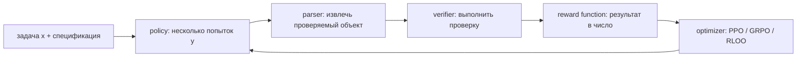

# RLVR и verifiers

> [!abstract] После главы
> Вы сможете превратить проверяемую задачу в RL environment: спроектировать raw
> schema, parser и verifier; вручную вычислить reward; отличить outcome reward
> от process supervision; обнаружить reward hacking и выбрать метрики, которые
> не позволяют спрятать его за растущим train reward.

## Главное различие

**RLVR** (reinforcement learning with verifiable rewards) говорит, **откуда
берётся reward**. Он не задаёт optimizer. Одни и те же проверяемые rewards можно
использовать в PPO, GRPO, RLOO или REINFORCE.



В RLHF скаляр часто предсказывает learned reward model. В RLVR источник истины
внешний: эталонный ответ, hidden tests, proof checker или состояние среды.
Verifier не обязан быть совершенным, но его контракт можно тестировать.

## Сквозной пример: линейное уравнение

Задача:

> Реши $3x+6=18$. Последняя строка должна иметь вид `FINAL: число`.

Raw record хранит не готовое рассуждение, а всё необходимое для независимой
проверки:

```json
{
  "id": "linear-0042",
  "prompt": "Реши 3x + 6 = 18. Последняя строка: FINAL: число",
  "task": "linear_equation",
  "verifier": {
    "type": "numeric_exact",
    "answer": "4",
    "tolerance": 0.0
  },
  "split": "train",
  "source": "generated-v1"
}
```

Policy сэмплировала четыре trajectories:

| ответ | извлечено | correct | format |
|---|---:|---:|---:|
| $y_1$: `3x=12 ... FINAL: 4` | 4 | 1 | 1 |
| $y_2$: `3x=12 ... Ответ 4` | — | 0 | 0 |
| $y_3$: `x=(18-6)/3 ... FINAL: 4.0` | 4.0 | 1 | 1 |
| $y_4$: `x=18/3+6 ... FINAL: 12` | 12 | 0 | 1 |

### Ручной расчёт reward

Пусть correctness — главный сигнал, а формат лишь малый shaping term:

$$
r(y)=r_{correct}(y)+0.1r_{format}(y).
$$

Тогда

$$
(r_1,r_2,r_3,r_4)=(1.1,0,1.1,0.1).
$$

Заметьте: $y_2$ математически содержит правильный ответ, но контракт не
выполнен. Для среды это parser failure, а не success. Если дать формату вес 1,
$y_4$ получит столько же, сколько правильное решение: модель сможет улучшать
reward, не улучшая математику. Shaping должен помогать exploration, а не
замещать целевое свойство.

## Schema → dataflow → objective

### 1. Dataset schema

Минимально нужны:

- стабильный `id` и provenance;
- prompt в точном inference format;
- тип verifier и ground truth/tests;
- split, созданный до генерации rollouts;
- task metadata для выбора reward function;
- ограничения среды: timeout, memory, allowed tools.

Нельзя хранить secret hidden tests в prompt-accessible metadata. Для code-задач
лучше разделить public examples и закрытый test bundle.

### 2. Rollout record

После генерации полезно сохранять не только текст:

```json
{
  "prompt_id": "linear-0042",
  "policy_revision": "step-1200",
  "seed": 17,
  "temperature": 0.8,
  "completion": "... FINAL: 4",
  "token_ids": [101, 913, 42],
  "old_logprobs": [-0.8, -0.2, -0.1],
  "parsed": "4",
  "verdict": "pass",
  "reward_components": {"correct": 1.0, "format": 1.0},
  "verifier_revision": "numeric-v3"
}
```

Без revision и raw completion невозможно воспроизвести reward после исправления
parser. Без old log-probabilities многие policy-gradient updates нельзя
корректно пересчитать.

### 3. RL objective

Verifier задаёт terminal reward $R(x,y)$. Общая цель:

$$
J(\theta)=\mathbb E_{x\sim D,\ y\sim\pi_\theta(\cdot|x)}[R(x,y)]
-\beta\,\mathbb E_x D_{KL}(\pi_\theta||\pi_{ref}).
$$

RLVR не объясняет, как оценить градиент этого expectation. Этим занимается
optimizer. Следующая глава разберёт group-relative estimator GRPO.

## Parser и verifier — разные программы

Parser отвечает: «какое утверждение сделала модель?» Verifier отвечает:
«истинно ли оно по спецификации?» Их опасно сливать: тогда нельзя различить
неверный ответ и нераспознанный формат.

```python
import re
from decimal import Decimal, InvalidOperation

FINAL = re.compile(r"(?m)^FINAL:\s*([-+]?\d+(?:\.\d+)?)\s*$")

def parse_final(text: str) -> Decimal | None:
    matches = FINAL.findall(text)
    if len(matches) != 1:       # неоднозначный вывод также reject
        return None
    try:
        return Decimal(matches[0])
    except InvalidOperation:
        return None

def numeric_reward(completion: str, answer: Decimal) -> dict[str, float]:
    predicted = parse_final(completion)
    format_ok = predicted is not None
    correct = format_ok and predicted == answer
    return {
        "correct": float(correct),
        "format": float(format_ok),
        "total": float(correct) + 0.1 * float(format_ok),
    }
```

Это учебный verifier. Production-версия должна иметь property tests: пробелы,
Unicode minus, scientific notation, несколько `FINAL`, NaN/Infinity, очень
длинный ввод и adversarial strings.

## Виды verifiers

### Exact и symbolic math

String exact match хрупок: `1/2`, `0.5` и $\frac12$ эквивалентны. Symbolic
verifier нормализует выражения и проверяет эквивалентность, но обязан ограничить
время simplification. Полезная открытая реализация —
[Math-Verify](https://github.com/huggingface/Math-Verify), используемая Open-R1.

### Code

Компиляция ещё не доказывает корректность. Нужны hidden tests, time/memory
limits, отключённая сеть, read-only filesystem и изоляция процесса. Reward
лучше строить из доли пройденных тестов только если partial credit не раскрывает
структуру hidden suite. Никогда не исполняйте rollout непосредственно на
training host.

### Tools и agents

Синтаксически правильный tool call — лишь промежуточное действие. Verifier
должен проверять конечное состояние: создан ли нужный объект, верна ли сумма,
не нарушены ли запрещённые действия. Цена, latency и число calls могут стать
отдельными штрафами.

### Formal proof

Proof assistant даёт сильный binary signal, но parser/type checker не гарантирует,
что statement соответствует исходной задаче. Следует фиксировать theorem
statement и разрешённые axioms.

## Outcome и process supervision

Outcome verifier оценивает финал. Один bit назначается всей цепочке из тысяч
токенов — credit assignment остаётся слабым. Process supervision оценивает
шаги, но бывает двух типов:

- **verifiable process reward**: шаг проверяет интерпретатор или proof checker;
- **process reward model**: learned model предсказывает качество шага.

Второй вариант уже не полностью verifiable: он наследует bias и distribution
shift reward model. Работа [Let’s Verify Step by Step](https://arxiv.org/abs/2305.20050)
полезна для сравнения outcome и process supervision, но её learned PRM не надо
называть формальным доказателем правильности.

## Curriculum и learnability

Для binary reward prompt полезен, когда policy иногда решает его, а иногда нет.
Если pass rate $p$, вероятность, что группа из $G$ ответов неоднородна:

$$
P(\text{есть оба исхода})=1-p^G-(1-p)^G.
$$

При $p=0.5,G=4$: $1-0.5^4-0.5^4=0.875$. При $p=0.01$ это лишь
$1-0.01^4-0.99^4\approx0.0394$. То есть 96% групп почти бесполезны для
сравнения. Поэтому Open-R1 фильтрует задачи по эмпирическому pass rate, а
production curriculum пересчитывает сложность по мере изменения policy.

## Reward hacking: тестировать verifier как security boundary

Типичные shortcuts:

- ответ прочитан из имени файла или metadata;
- parser принимает последнее число из мусора;
- код читает hidden tests, сеть или соседние процессы;
- решение проходит слабые examples, но нарушает specification;
- format bonus компенсирует неправильный ответ;
- дубликаты train/test создают иллюзию reasoning;
- модель увеличивает длину, потому что длина коррелировала с success.

Red-team verifier должен включать intentionally wrong solutions, malformed but
correct outputs, time bombs, resource exhaustion, prompt injections в task data
и попытки вывести секретные tests.

## Метрики

Средний reward — диагностическая метрика среды, не итоговая метрика способности.
Логируйте:

| слой | обязательные показатели |
|---|---|
| parser | parse rate, ambiguous rate, failures по шаблонам |
| verifier | false accept/reject на вручную размеченном наборе, timeout rate |
| rollouts | pass@1, pass@$k$, длина, EOS rate, diversity |
| learning signal | доля mixed-outcome/non-zero-variance groups |
| policy | KL к reference, entropy, clip fraction |
| generalization | held-out generators, OOD difficulty, non-RLVR regressions |
| systems | generated tokens/s, verifier latency, cost per verified success |

Для честного before/after pass@1 фиксируют prompt template, temperature,
max tokens и evaluator revision.

## Production implementations

- [Open-R1](https://github.com/huggingface/open-r1) — генерация, pass-rate
  filtering, Math-Verify, code sandboxes и GRPO recipes.
- [Open Instruct](https://github.com/allenai/open-instruct) — полный Tülu 3
  pipeline и mixed-task RLVR.
- [verl PPO architecture](https://verl.readthedocs.io/en/latest/examples/ppo_code_architecture.html)
  — `RewardManager`, function/model rewards и распределение workers.
- [TRL advanced multi-reward cookbook](https://huggingface.co/learn/cookbook/trl_grpo_reasoning_advanced_reward)
  — runnable пример нескольких reward functions.

## Практикум

1. Сгенерируйте 500 линейных уравнений с solution, вычисленным отдельной
   программой.
2. Разделите по коэффициентам до генерации ответов; не делайте random split
   почти одинаковых строк.
3. Напишите parser и не менее 30 unit/property tests, включая два `FINAL`.
4. Сэмплируйте по 8 ответов; постройте histogram pass rate по prompts.
5. Удалите задачи с $p=0$ и $p=1$ только из training curriculum, но сохраните
   их в evaluation.
6. Сравните binary reward с `correct + 0.1 format`; проверьте, не растёт ли
   format быстрее accuracy.
7. Вручную разберите 50 passed trajectories: отметьте неверный CoT с верным
   финалом.
8. Попробуйте атаковать собственный parser. Исправьте verifier и пересчитайте
   старые raw rollouts новой revision.

## Курсы и объяснения

- Nathan Lambert — [RLHF Book, Lecture 3: RL и RLVR](https://rlhfbook.com/teach/course/lec3-chap6-p1/),
  включая доступные слайды.
- Hugging Face — [Reasoning Course](https://huggingface.co/reasoning-course):
  упражнения по GRPO, TRL и DeepSeek-R1.
- DeepLearning.AI — [Reinforcement Learning from Human Feedback](https://www.deeplearning.ai/courses/reinforcement-learning-from-human-feedback):
  фон по reward, policy и KL; RLVR следует читать как замену источника reward.

## Первоисточники

- Cobbe et al., 2021 — [Training Verifiers to Solve Math Word Problems](https://arxiv.org/abs/2110.14168).
- Lightman et al., 2023 — [Let’s Verify Step by Step](https://arxiv.org/abs/2305.20050).
- Lambert et al., 2024 — [Tülu 3](https://arxiv.org/abs/2411.15124), открытый
  multi-stage post-training recipe, закрепивший термин RLVR.
- DeepSeek-AI, 2025 — [DeepSeek-R1](https://arxiv.org/abs/2501.12948).

> [!summary] Проверка понимания без теста
> RLVR начинается не с выбора GRPO, а с исполнимой спецификации. Если parser,
> sandbox и split ненадёжны, optimizer лишь быстрее научится использовать их
> ошибки.
