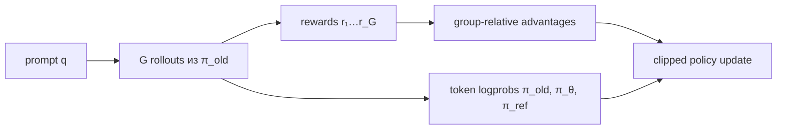
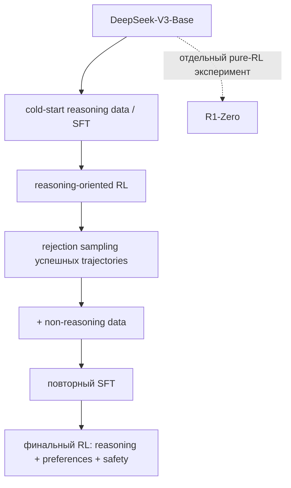

# GRPO и DeepSeek-R1

> [!abstract] После главы
> Вы сможете вручную вычислить group-relative advantages и clipped policy loss,
> объяснить, что GRPO убирает critic, но не rollout cost, различить варианты
> normalization/KL и восстановить полный pipeline R1 вместо мифа «R1 — это
> pure GRPO на математике».

## Где находится GRPO

RLVR задаёт reward. **GRPO задаёт estimator advantage и семейство policy
updates**. Он может работать с verifiable function, reward model или их смесью.

![[02 Areas/ML & DL/00 Учебник/Assets/Figures/curated/grpo/ppo-vs-grpo.png]]

*В PPO baseline предсказывает critic; в GRPO baseline строится по нескольким
ответам на один prompt. Источник: Shao et al., 2024,
[DeepSeekMath](https://arxiv.org/abs/2402.03300).*



## Сквозной численный пример

Для задачи $3x+6=18$ четыре rewards из предыдущей главы:

$$r=(1.1,0,1.1,0.1).$$

Среднее:

$$\bar r=\frac{1.1+0+1.1+0.1}{4}=0.575.$$

Используем population standard deviation:

$$
s=\sqrt{\frac{(0.525)^2+(-0.575)^2+(0.525)^2+(-0.475)^2}{4}}
\approx0.5262.
$$

Advantages:

$$
\hat A\approx(0.998,-1.093,0.998,-0.903).
$$

Если все четыре ответа получили 1.1, $s=0$, а после centering все advantages
нулевые. Успешная, но однородная группа не даёт относительного сигнала.

## От sequence reward к token update

Ответ генерировала frozen snapshot $\pi_{old}$. Для каждого completion token:

$$
\rho_{i,t}(\theta)=
\exp(\log\pi_\theta(o_{i,t}|q,o_{i,<t})-
\log\pi_{old}(o_{i,t}|q,o_{i,<t})).
$$

Положительный advantage просит увеличить вероятность всей trajectory;
отрицательный — уменьшить. PPO-style clipping ограничивает один update:

$$
L^{clip}_{i,t}=\min\left(
\rho_{i,t}\hat A_i,
\operatorname{clip}(\rho_{i,t},1-\epsilon,1+\epsilon)\hat A_i
\right).
$$

### Ручной clipping

Пусть $\epsilon=0.2$.

- Для хорошего $y_1$, $\hat A_1=0.998$, а probability ratio токена вырос до
  $\rho=1.35$. Unclipped term $1.35\cdot0.998=1.347$; clipped
  $1.2\cdot0.998=1.198$. Берём 1.198: чрезмерный рост не поощряется.
- Для плохого $y_2$, $\hat A_2=-1.093$, а ratio упал до $0.70$.
  Unclipped $=-0.765$; clipped $0.8\cdot(-1.093)=-0.874$. Minimum равен
  $-0.874$: чрезмерное уменьшение также не даёт дополнительной выгоды.

Loss — минус среднее $L^{clip}$, поэтому gradient descent максимизирует
ограниченную surrogate objective.

## Полная учебная цель

Один распространённый вариант:

$$
\mathcal L_{GRPO}=-\frac1G\sum_i\frac1{|o_i|}\sum_t
\left[L^{clip}_{i,t}-\beta\widehat D_{KL}(\pi_\theta||\pi_{ref})_{i,t}\right].
$$

Здесь существуют **три разные модели**:

- $\pi_{old}$ — snapshot, породивший rollout; нужен для importance ratio;
- $\pi_\theta$ — обновляемая policy;
- $\pi_{ref}$ — более медленный reference, обычно исходный SFT checkpoint.

Смешивать old и reference нельзя. Clipping ограничивает изменение относительно
rollout policy, KL — дрейф относительно reference.

## Минимальная реализация математики

```python
import torch

def group_advantages(rewards, eps=1e-4, scale=True):
    rewards = torch.as_tensor(rewards, dtype=torch.float32)
    centered = rewards - rewards.mean(dim=-1, keepdim=True)
    if not scale:
        return centered
    std = rewards.std(dim=-1, keepdim=True, unbiased=False)
    return centered / (std + eps)

def clipped_token_loss(new_lp, old_lp, advantages, mask, clip_eps=0.2):
    # new_lp/old_lp: [batch, response_tokens]
    ratio = (new_lp - old_lp).exp()
    a = advantages[:, None]
    surrogate = torch.minimum(
        ratio * a,
        ratio.clamp(1 - clip_eps, 1 + clip_eps) * a,
    )
    per_sequence = (surrogate * mask).sum(-1) / mask.sum(-1).clamp_min(1)
    return -per_sequence.mean()
```

Production code обязан также маскировать prompt/padding, учитывать truncation,
добавлять KL, синхронизировать rollout weights и разбивать batch на minibatches.

## Почему std-normalization спорна

Деление на group std делает масштабы разных prompts похожими, но усиливает
редкие различия в почти однородной группе. Оно также создаёт difficulty bias.
Текущий [TRL GRPOTrainer](https://huggingface.co/docs/trl/main/grpo_trainer)
позволяет `scale_rewards=False` или batch-level scaling.

Например, $r=(1,1,1,0)$ и $r=(0.51,0.50,0.50,0.50)$ после собственной
нормализации группы дают сравнимые standardized advantages, хотя абсолютная
разница verifier во втором случае крошечна. Выбор допустим только вместе с
пониманием семантики reward.

## Length normalization

Если loss усреднять сначала по токенам каждой sequence, короткая и длинная
trajectory получают равный sequence weight. Если суммировать все token losses и
делить на общее число токенов, длинные ответы дают больше token observations.
Это разные estimators. Оригинальный DeepSeekMath и современные реализации не
всегда совпадают; TRL прямо документирует отказ от исходной нормализации из-за
response-level length bias.

## KL не является обязательной частью любого «GRPO»

DeepSeekMath включает reference KL. В актуальном TRL `beta=0.0` по умолчанию:
несколько последующих reasoning recipes обнаружили, что обучение возможно без
явного KL. Поэтому корректно писать конфигурацию:

```yaml
algorithm: grpo
group_size: 8
scale_rewards: false
beta: 0.0
loss_aggregation: token_mean
```

а не считать, что одно слово GRPO полностью задаёт эксперимент.

## Minimal runnable TRL recipe

```python
from datasets import load_dataset
from trl import GRPOConfig, GRPOTrainer
from trl.rewards import accuracy_reward

data = load_dataset("trl-lib/DeepMath-103K", split="train")
args = GRPOConfig(
    output_dir="qwen-grpo-demo",
    num_generations=8,
    max_completion_length=512,
    temperature=0.8,
    learning_rate=1e-6,
    beta=0.0,
    scale_rewards=False,
)
trainer = GRPOTrainer(
    model="Qwen/Qwen2.5-0.5B-Instruct",
    args=args,
    train_dataset=data,
    reward_funcs=accuracy_reward,
)
trainer.train()
```

Это учебный запуск, не recipe для воспроизведения R1. Даже документационный
пример на 0.5B и восьми GPU занимает примерно сутки; главный расход —
генерация $G$ completions.

## Training–inference mismatch

Rollouts часто делает vLLM, а log-probabilities для gradient — Transformers.
Из-за precision и kernels $\pi_{inference}\ne\pi_{train}$. Формально on-policy
update становится off-policy:

$$y\sim\pi_{inference},\qquad \nabla\log\pi_{train}(y)R(y).$$

[TRL](https://huggingface.co/docs/trl/main/grpo_trainer) предлагает truncated
или masked importance sampling. В server mode inference и trainer должны быть
на разных GPU; в colocate mode memory делят weights, KV cache и optimizer.

## R1-Zero и R1 — два разных эксперимента

### DeepSeek-R1-Zero

R1-Zero стартует от **DeepSeek-V3-Base**, без reasoning SFT непосредственно
перед RL. Verifiable rewards усилили математические способности, длину ответа,
self-checking и exploration patterns. Это свидетельство, что human-written CoT
не является обязательным непосредственным target для возникновения полезных
trajectories.

Но «zero» не означает отсутствие человеческих данных: base model уже обучена
на огромном корпусе. Pure RL также не гарантировал удобный продуктовый output:
наблюдались плохая читаемость и language mixing.

### Полный DeepSeek-R1

![[02 Areas/ML & DL/00 Учебник/Assets/Figures/deepseek-r1-figure1-hq.png]]

*Полный multi-stage pipeline. Источник: DeepSeek-AI,
[DeepSeek-R1](https://arxiv.org/abs/2501.12948), Figure 1.*



1. **Cold start** задаёт читаемый формат и устойчивую исходную policy.
2. **Reasoning RL** исследует решения проверяемых задач.
3. **Rejection sampling** превращает успешные online rollouts в offline data.
4. **SFT на смеси** возвращает общие non-reasoning возможности.
5. **Final RL** сочетает reasoning и human-preference signals.

Следовательно, «R1 = GRPO» теряет data flywheel и два SFT-этапа — большую часть
инженерного recipe.

## Что означает «aha moment»

В отчёте показан пример, где модель останавливается и пересматривает решение.
Это интересный наблюдаемый текстовый паттерн. Он не доказывает сознание,
универсальный внутренний search algorithm или истинность каждого CoT-токена.
Строгий вывод: оптимизация outcome reward повысила вероятность trajectories,
включающих полезные проверки и исправления на данном распределении задач.

## Failure modes и dashboard

| симптом | возможная причина | что проверить |
|---|---|---|
| reward растёт, eval нет | verifier shortcut/contamination | held-out generator, red team |
| длина быстро растёт | length correlation, слабый stop | accuracy conditioned on length |
| entropy падает | слишком большой LR/мало diversity | entropy, unique answers |
| 90% групп zero variance | задачи слишком лёгкие/трудные | pass-rate curriculum |
| KL скачет | stale rollouts или агрессивный update | policy revision, ratios |
| loss NaN | tiny std, bad logprobs | eps, finite checks, masks |
| format растёт без correct | shaping overweighted | reward components separately |

Минимальный dashboard: train reward components, held-out pass@1/pass@$k$,
mixed-outcome groups, response length quantiles, entropy, KL, clip fraction,
importance-ratio tails, EOS rate и generated tokens per success.

## Production implementations

- [Open-R1](https://github.com/huggingface/open-r1): наиболее читаемый путь
  SFT/GRPO; есть single-node colocate и multi-node vLLM server recipes.
- [Open Instruct](https://github.com/allenai/open-instruct): Tülu 3 RLVR и
  открытые intermediate checkpoints.
- [verl](https://github.com/verl-project/verl): Ray workers, FSDP/Megatron,
  vLLM/SGLang и recipes GRPO/DAPO; production-oriented.
- [OpenRLHF](https://github.com/OpenRLHF/OpenRLHF): Ray + vLLM + DeepSpeed,
  dynamic filtering и несколько RL algorithms.

Особый gotcha Open-R1: chat template distilled DeepSeek models prefill’ит
`<think>` и может скрывать reasoning block. Для format reward template нужно
override; иначе вы оптимизируете ошибку сериализации.

## Практикум

1. Воспроизведите ручной пример в tensor code и получите advantages с точностью
   $10^{-3}$.
2. Постройте график $P(\text{mixed group})$ для $G=2,4,8,16$ и $p\in[0,1]$.
3. Сравните `scale_rewards=True/False` на искусственных continuous rewards.
4. Напишите тесты clipping отдельно для положительного и отрицательного
   advantage: знак меняет активную границу.
5. Запустите маленький TRL experiment; сохраните raw completions до и после.
6. Повторите с одинаковым token budget для SFT на successful rollouts.
7. Измените только aggregation по длине и проверьте response length/pass@1.
8. Для отчёта перечислите policy, old policy, reference, verifier revision и
   inference engine. Если чего-то нет — эксперимент не воспроизводим.

## Курсы и объяснения

- Hugging Face — [Reasoning Course](https://huggingface.co/reasoning-course) и
  [GRPOTrainer guide](https://huggingface.co/docs/trl/main/grpo_trainer).
- Nathan Lambert — [RLHF Book course](https://rlhfbook.com/course), лекции по
  policy gradients, RLVR и современному post-training со слайдами.
- [Open-R1 blog](https://huggingface.co/blog/open-r1) — реконструкция missing
  data/code частей R1 и схема проекта.

## Первоисточники

- Shao et al., 2024 — [DeepSeekMath](https://arxiv.org/abs/2402.03300):
  исходная публикация GRPO.
- DeepSeek-AI, 2025 — [DeepSeek-R1](https://arxiv.org/abs/2501.12948):
  R1-Zero, multi-stage R1, результаты и distillation.
- Ahmadian et al., 2024 — [Back to Basics: REINFORCE Style Optimization for Learning from Human Feedback](https://arxiv.org/abs/2402.14740):
  полезный контекст о critic-free estimators.

> [!summary]
> GRPO экономит value model, а не generation. DeepSeek-R1 — не название
> optimizer, а многоэтапный data-and-training pipeline.
