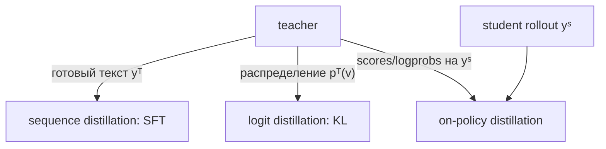
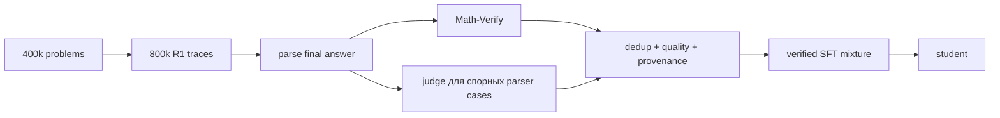

# Reasoning distillation

> [!abstract] После главы
> Вы не будете называть одним словом три разных метода: SFT на teacher traces,
> matching teacher logits и on-policy distillation на student rollouts. Вы
> сможете построить verified data pipeline, вручную посчитать soft-target KL и
> выбрать метод по доступу к teacher, tokenizer и compute.

## Три разных объекта под одним названием



1. **Sequence-level distillation**: teacher генерирует решение, student
   максимизирует его likelihood. Так устроены DeepSeek-R1-Distill и Open-R1 SFT
   reproduction.
2. **Logit distillation**: student сопоставляет soft distribution teacher по
   словарю.
3. **On-policy distillation**: student генерирует собственные trajectories, а
   teacher даёт плотный сигнал именно на состояниях student.

Это разные данные, losses и failure modes. Успех одного не доказывает
применимость остальных.

## Сквозной пример

Prompt: `Реши 3x+6=18; закончи FINAL: число`.

Teacher сэмплировал три traces:

```text
t1: Вычтем 6: 3x=12. Разделим на 3. FINAL: 4       pass
t2: Перенесём 6: 3x=24. FINAL: 8                   fail
t3: Проверка: 3·4+6=18. Следовательно FINAL: 4     pass
```

Verifier оставляет `t1` и `t3`. Но correctness финала ещё не выбирает лучший
target: `t3` учит проверке, `t1` — прямому решению. Вместо «самого длинного»
нужна явная policy отбора: correctness, parseability, deduplication, язык,
длина и разнообразие стратегий.

## Sequence distillation: teacher outputs становятся SFT data

### Raw generation schema

```json
{
  "prompt_id": "linear-0042",
  "teacher": "DeepSeek-R1",
  "teacher_revision": "2025-01",
  "sampling": {"temperature": 0.6, "top_p": 0.95, "max_tokens": 16384},
  "seed": 31,
  "completion_raw": "Вычтем 6... FINAL: 4",
  "parsed_answer": "4",
  "verifier_revision": "numeric-v3",
  "verdict": "pass",
  "token_count": 19
}
```

Сохраняйте raw failures: без них нельзя измерить bias фильтра. Финальный SFT
record может быть проще:

```json
{
  "messages": [
    {"role": "user", "content": "Реши 3x+6=18..."},
    {"role": "assistant", "content": "Вычтем 6... FINAL: 4"}
  ],
  "provenance": {"prompt_id": "linear-0042", "teacher_sample": 0}
}
```

### Objective и ручной расчёт

Для target tokens $y^T$:

$$
\mathcal L_{seq}=-\sum_t m_t\log\pi_S(y_t^T|x,y^T_{<t}).
$$

Пусть три assistant tokens получили probabilities $(0.50,0.25,0.80)$.

$$
L=-[\ln0.50+\ln0.25+\ln0.80]
=-\ln0.1\approx2.303.
$$

Средний token NLL $=0.768$, perplexity $e^{0.768}\approx2.16$. Все
альтернативные tokens teacher исчезли: student видит один sampled path, а не
неуверенность teacher.

### Минимальный код

```python
from datasets import load_dataset
from trl import SFTConfig, SFTTrainer

data = load_dataset("open-r1/Mixture-of-Thoughts", "all", split="train")
args = SFTConfig(
    output_dir="reasoning-student",
    max_length=32768,
    assistant_only_loss=True,
    learning_rate=4e-5,
    num_train_epochs=1,
    bf16=True,
    gradient_checkpointing=True,
)
trainer = SFTTrainer(
    model="Qwen/Qwen2.5-Math-1.5B",
    args=args,
    train_dataset=data,
)
trainer.train()
```

Chat template должен поддерживать assistant mask. Для Qwen base EOS должен
совпасть с ChatML (`<|im_end|>`); Open-R1 выделяет эту ошибку отдельно.

## Как Open-R1 строил reasoning data

[Open-R1 Update #2](https://huggingface.co/blog/open-r1/update-2) — редкий
публичный production case:

- 400 тысяч math prompts из NuminaMath 1.5;
- два teacher solutions, иногда четыре: около 800 тысяч traces;
- до 16k tokens на generation; 8k хватало лишь примерно 75% задач;
- Math-Verify для автоматической проверки;
- Llama-3.3-70B judge для части parser failures;
- 220 тысяч задач после filtering.



Это не «скачали ответы R1 и обучили». Generation cap, number of samples,
verifier recall и selection policy определяют curriculum student.

## Selection bias

Фильтр `оставить только pass` меняет распределение:

- трудные задачи, которые teacher редко решает, исчезают чаще;
- parser-friendly стиль переоценивается;
- короткие задачи дешевле и могут доминировать;
- популярная стратегия teacher вытесняет редкие корректные стратегии;
- fallback judge создаёт отдельный класс меток с другой надёжностью.

В датасете следует хранить число attempts и teacher pass rate. Один прошедший
trace из 64 попыток — другой пример сложности, чем 4 из 4.

## Logit distillation

Teacher и student видят один prefix. При temperature $T$:

$$
p_T(v)=\operatorname{softmax}(z_T(v)/T),\qquad
p_S(v)=\operatorname{softmax}(z_S(v)/T),
$$

$$
L_{KD}=T^2\sum_v p_T(v)\log\frac{p_T(v)}{p_S(v)}.
$$

$T>1$ раскрывает «тёмные знания»: teacher может считать несколько tokens
правдоподобными, хотя sampled target только один.

### Ручной KL

Для трёх tokens teacher даёт $p_T=(0.7,0.2,0.1)$, student
$p_S=(0.5,0.4,0.1)$ при уже выбранном $T=1$:

$$
D_{KL}=0.7\ln(1.4)+0.2\ln(0.5)+0.1\ln(1)
\approx0.2355-0.1386=0.0969.
$$

Hard-label CE увидела бы только правильный token. KL также сообщает, что
второй token teacher считает вдвое вероятнее третьего.

```python
import torch.nn.functional as F

def kd_loss(student_logits, teacher_logits, temperature=2.0):
    s = F.log_softmax(student_logits / temperature, dim=-1)
    t = F.softmax(teacher_logits / temperature, dim=-1)
    return F.kl_div(s, t, reduction="batchmean") * temperature**2
```

### Ограничения

- Нужен доступ к teacher logits, которого API обычно не предоставляет.
- Полный tensor `batch × seq × vocab` дорог в памяти и передаче.
- Прямой KL требует общего token space. Разные tokenizers не дают естественного
  соответствия vocabulary indices.
- Offline logits на teacher-forced trajectories не устраняют exposure bias
  student.

## On-policy distillation

В sequence/logit KD student обучается на teacher trajectories. На inference он
попадает в собственные prefixes, где teacher targets не были собраны.
On-policy distillation делает наоборот:

1. student генерирует $y^S\sim\pi_S$;
2. teacher оценивает next-token distributions на prefixes $y^S_{<t}$;
3. student приближается к teacher именно на своей state distribution.

$$
L_{on-policy}=\mathbb E_{x,\,y^S\sim\pi_S}
\sum_t D(\pi_T(\cdot|x,y^S_{<t})||\pi_S(\cdot|x,y^S_{<t})).
$$

Это похоже на online RL тем, что данные меняются вместе со student, но сигнал —
teacher distribution, а не scalar verifier reward.

### Практическая реализация

Экспериментальный [TRL DistillationTrainer](https://github.com/huggingface/trl/blob/main/docs/source/distillation_trainer.md)
использует:

- prompt-only dataset;
- generation buffer, отделяющий большой vLLM batch от train microbatch;
- внешний teacher vLLM server;
- бинарную передачу log-probabilities вместо огромного JSON.

API находится в `trl.experimental`, поэтому recipe нужно pin’ить по версии или
commit.

## Sequence, logit или on-policy?

| условие | естественный выбор |
|---|---|
| teacher доступен только как text API | sequence distillation |
| есть weights/logits и общий tokenizer | logit KD |
| важен exposure mismatch, есть online teacher compute | on-policy KD |
| ответы можно надёжно проверить, logits недоступны | verified sequence SFT |
| student почти никогда не решает задачу | сначала sequence SFT/curriculum |
| teacher дорог, data надо переиспользовать | offline sequence/logit dataset |

Методы можно сочетать: verified teacher traces для warm start, затем on-policy
KD или RLVR на сложности, где student уже получает ненулевой сигнал.

## Distillation не копирует внутренний алгоритм

Loss ограничивает output behavior на наблюдаемых prefixes. Student может найти
другую внутреннюю реализацию, не вместить стратегию teacher или просто
запомнить шаблоны. Chain-of-thought также не является гарантированно faithful
описанием внутренних вычислений. Корректный вывод: переносится распределение
наблюдаемых outputs на выбранных данных.

## Failure modes и метрики

### Данные

- contamination между source problems и benchmarks;
- repeated templates после поверхностного dedup;
- correct final answer с неверным reasoning;
- dominance одного языка/формата/teacher style;
- judge labels без provenance;
- truncation, удаляющий финальный ответ или важную проверку.

### Обучение

- assistant mask включает prompt;
- chat template/EOS не совпадает с inference;
- sequence packing смешивает независимые диалоги;
- длинные traces доминируют по числу token losses;
- logit KD перепутал направление KL;
- teacher и student logits относятся к разным token positions.

### Evaluation

Логируйте pass@1 и pass@$k$, accuracy по difficulty bins, response-length
quantiles, parse rate, reasoning error audit, general benchmarks, style/language
mixing, calibration и cost per solved problem. Сравнивайте с обычным SFT на
равном числе **обучающих tokens**, а не examples.

## Production recipe: Open-R1

```bash
ACCELERATE_LOG_LEVEL=info accelerate launch \
  --config_file recipes/accelerate_configs/zero3.yaml \
  src/open_r1/sft.py \
  --config recipes/OpenR1-Distill-7B/sft/config_distill.yaml
```

[Open-R1](https://github.com/huggingface/open-r1) публикует config, dataset,
evaluation commands и intermediate model. Это хороший reproducibility
baseline. [Distilabel](https://github.com/argilla-io/distilabel) полезен для
масштабируемой synthetic-data orchestration, но сам по себе не определяет
distillation objective.

## Практикум

1. Для 1000 задач сгенерируйте по четыре teacher traces; сохраните failures.
2. Реализуйте verifier и пометьте provenance каждого решения.
3. Сравните три selection policies: первый pass, кратчайший pass, diverse pass.
4. Обучите одинаковый student на каждой выборке при равном token budget.
5. Вручную проверьте 100 traces и оцените false-pass финального verifier.
6. На toy vocabulary воспроизведите KL $0.0969$ и проверьте gradient direction.
7. Сымитируйте exposure mismatch: добавьте ошибочный student prefix и сравните
   teacher target на нём с offline target.
8. Проведите eval с тем же decoding recipe и отдельным OOD generator задач.
9. В отчёте разделите improvements от data volume, filtering и самого loss.

## Курсы и объяснения

- Hugging Face — [Open-R1 course/project](https://huggingface.co/reasoning-course)
  и [Open-R1 Update #2](https://huggingface.co/blog/open-r1/update-2).
- Nathan Lambert — [Lecture 7: Synthetic Data and Modern Post-training](https://rlhfbook.com/teach/course/lec7-chap12-synthetic-data/slides.pdf).
- Hinton, Vinyals, Dean — исходная статья и классическая интуиция soft targets:
  [Distilling the Knowledge in a Neural Network](https://arxiv.org/abs/1503.02531).

## Первоисточники

- Hinton et al., 2015 — [Distilling the Knowledge in a Neural Network](https://arxiv.org/abs/1503.02531).
- DeepSeek-AI, 2025 — [DeepSeek-R1](https://arxiv.org/abs/2501.12948):
  sequence-distilled Qwen/Llama models и multi-stage pipeline.
- Agarwal et al., 2024 — [On-Policy Distillation of Language Models: Learning from Self-Generated Mistakes](https://arxiv.org/abs/2306.13649):
  generalized/on-policy KD для autoregressive models.
- Hugging Face — [Open-R1 repository](https://github.com/huggingface/open-r1)
  и открытый verified data recipe.

> [!summary]
> «Distilled from R1» обычно означает SFT на отфильтрованных текстовых traces,
> а не копирование logits или внутреннего reasoning algorithm. Всегда спрашивайте:
> кто генерировал prefixes, какой сигнал передавал teacher и что отфильтровал
> verifier.
