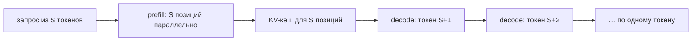
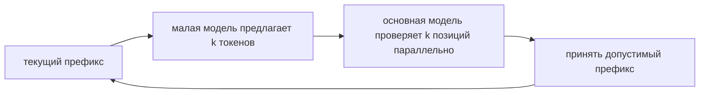

# Инференс языковой модели: KV-кеш, пакетирование и FlashAttention

> [!abstract] После этой главы
> Вы сможете раздельно оценить стоимость обработки запроса и генерации ответа,
> вывести объём KV-кеша, объяснить непрерывное пакетирование и страничное
> размещение памяти, а также отличить FlashAttention от разреженного внимания.
> В конце мы соберём эти механизмы в одну систему обслуживания и разберём, почему
> максимальная пропускная способность не означает минимальную задержку.

## 1. Два режима одной и той же модели

Авторегрессионная модель выполняет запрос в два этапа.

**Обработка входа** (*prefill*) принимает сразу все $S$ токенов запроса. Матрицы
запросов, ключей и значений для разных позиций вычисляются параллельно. Большие
матричные умножения обычно хорошо загружают ускоритель, поэтому этот этап часто
ограничен вычислительной производительностью.

**Пошаговая генерация** (*decode*) добавляет по одному токену. На каждом шаге
модель снова читает параметры всех слоёв и накопленные ключи и значения, но
выполняет сравнительно мало арифметики. Для небольшого пакета этот этап часто
ограничен пропускной способностью памяти.



Это различие определяет почти всю архитектуру сервера. Оптимизация длинных
запросов и оптимизация множества коротких шагов — разные задачи, хотя они
используют одни параметры модели.

## 2. Зачем нужен KV-кеш

В слое причинного внимания для нового токена $t$ нужны его запрос $q_t$ и ключи
и значения всех позиций $1,ldots,t$:

$$
o_t=\operatorname{softmax}\left(\frac{q_tK_{1:t}^{\top}}{\sqrt{d_h}}+M\right)V_{1:t}.
$$

Ключи и значения прежних токенов не меняются. Если вычислять их заново на
каждом шаге, начало последовательности будет многократно проходить через одни и
те же проекции. KV-кеш сохраняет $K$ и $V$ после первого вычисления; для нового
токена добавляется только одна новая пара.

![[02 Areas/ML & DL/00 Учебник/Assets/Figures/kv-cache-prefill-decode.svg]]

*При генерации вычисляются ключ и значение нового токена, а предыдущие берутся
из кеша. Без кеша модель повторно обрабатывала бы весь префикс на каждом шаге.*

Кеш не устраняет внимание к прошлым токенам: запрос нового токена всё ещё нужно
сопоставить со всеми сохранёнными ключами. Он устраняет повторное вычисление
самих ключей и значений.

## 3. Объём KV-кеша

Пусть

- $L$ — число слоёв;
- $S$ — текущая длина последовательности;
- $H_{kv}$ — число голов ключей и значений;
- $d_h$ — размер одной головы;
- $b$ — число байт на элемент.

Для одного запроса объём кеша равен

$$
M_{KV}=2LSH_{kv}d_hb,
$$

где множитель 2 соответствует ключам и значениям. Для обычного MHA
$H_{kv}=H_q$, для GQA голов KV меньше, а для MQA $H_{kv}=1$.

### Численный пример

Возьмём модель с 32 слоями, 8 головами KV, размером головы 128 и точностью BF16.
Для контекста 8192 токена:

$$
M_{KV}=2\cdot32\cdot8192\cdot8\cdot128\cdot2
=1\,073\,741\,824\text{ байт}\approx1\text{ ГиБ}.
$$

Это память только одного запроса и только для KV. Сто запросов такой длины не
поместятся в 80 ГиБ, даже если параметры модели занимают существенно меньше.
Поэтому GQA, квантование KV, ограничение длины и управление размещением кеша
непосредственно определяют вместимость сервера.

## 4. Почему статический пакет плохо подходит генерации

При обычном пакетировании несколько запросов начинают и заканчивают работу
вместе. Для генерации это неудобно: ответы имеют разную длину, а новые запросы
поступают постоянно. Если ждать завершения самого длинного ответа, ускоритель
простаивает на местах уже закончившихся последовательностей.

**Непрерывное пакетирование** пересобирает рабочий пакет между шагами генерации.
Закончившийся запрос удаляется, а освободившееся место занимает новый. В один
момент внутри пакета могут находиться запросы на совершенно разных позициях
ответа.

```text
шаг 1: [A1 B1 C1]
шаг 2: [A2 B2 C2]   C закончил
шаг 3: [A3 B3 D1]   D вошёл без ожидания A и B
шаг 4: [A4 E1 D2]   B закончил, вошёл E
```

Чем больше активных последовательностей, тем лучше повторное чтение параметров
модели окупается полезной работой. Но большой пакет повышает время ожидания в
очереди и может ухудшить задержку отдельного пользователя.

## 5. PagedAttention и размещение кеша страницами

Если заранее выделять каждому запросу непрерывный участок под максимальную
длину, большая часть памяти останется пустой, а запросы переменной длины вызовут
фрагментацию. PagedAttention заимствует идею виртуальной памяти: KV-кеш делится
на блоки фиксированного размера, а логическая последовательность указывает на
таблицу физических блоков.

![[02 Areas/ML & DL/00 Учебник/Assets/Figures/curated/kv-cache/paged-attention.png]]

*Логически соседние токены могут храниться в разных физических блоках. Таблица
блоков позволяет наращивать кеш без большого непрерывного резервирования.
Источник: Kwon et al., [Efficient Memory Management for Large Language Model
Serving with PagedAttention](https://arxiv.org/abs/2309.06180).*

Такое размещение даёт несколько преимуществ:

- память выделяется по мере роста ответа;
- освобождённые блоки быстро возвращаются общему пулу;
- несколько вариантов продолжения могут совместно использовать блоки общего префикса;
- уменьшается внутренняя и внешняя фрагментация.

Цена — дополнительная косвенная адресация и необходимость специальных ядер
внимания, умеющих читать разнесённые блоки.

## 6. Планировщик: кого запускать следующим

Сервер конкурирует за три ресурса: вычисления, память KV-кеша и допустимую
задержку. Планировщик решает, какие операции включить в следующий шаг:

- обработать новый длинный запрос;
- продолжить генерацию уже активных ответов;
- временно вытеснить или перенести кеш;
- разбить длинный prefill на части, чтобы не задерживать decode;
- переиспользовать кеш совпадающего префикса.

Если большой prefill монополизирует ускоритель, активные пользователи долго не
получают следующий токен. **Chunked prefill** делит вход на части и чередует их
с шагами генерации. Это улучшает отзывчивость, но усложняет планирование и может
немного снизить максимальную пропускную способность.

## 7. FlashAttention: меньше перемещений, тот же результат

Обычная запись внимания

$$
O=\operatorname{softmax}(QK^\top)V
$$

создаёт впечатление, что нужно материализовать матрицу $S\times S$ в памяти
ускорителя. Для длинной последовательности многократная запись и чтение этой
матрицы обходятся дорого.

FlashAttention разбивает $Q$, $K$ и $V$ на плитки, переносит их в быструю
локальную память ускорителя и вычисляет softmax по частям. Чтобы объединить
частичные результаты без полной матрицы внимания, алгоритм хранит для каждой
строки текущий максимум и нормировочную сумму.

Для двух блоков логитов с максимумами $m_1,m_2$ и суммами экспонент $\ell_1,
\ell_2$ общий максимум

$$m=\max(m_1,m_2),$$

а общая нормировочная сумма

$$
\ell=e^{m_1-m}\ell_1+e^{m_2-m}\ell_2.
$$

Такая онлайн-нормировка численно устойчива и позволяет обрабатывать блоки
последовательно. FlashAttention вычисляет **точное** внимание с обычной
погрешностью операций с плавающей точкой. Он не вводит разреженность, не
сокращает контекст и не меняет архитектуру модели; выигрыш достигается за счёт
меньшего обмена с HBM и слияния операций.

FlashAttention особенно важен при обучении и prefill, где запросов много. При
декодировании одного токена узким местом чаще становятся чтение параметров и
разрозненного KV-кеша, поэтому требуются специализированные paged-decode kernels.

## 8. Спекулятивное декодирование

Авторегрессионность заставляет большую модель делать отдельный проход для
каждого следующего токена. Спекулятивное декодирование поручает дешёвой модели
быстро предложить несколько токенов, после чего основная модель проверяет их
одним параллельным проходом.



При корректном алгоритме принятия распределение ответов основной модели не
меняется. Ускорение зависит от трёх величин:

- насколько быстрее работает модель-предложитель;
- какую долю предложенных токенов принимает основная модель;
- насколько эффективно проверка нескольких позиций использует ускоритель.

Слишком слабый предложитель часто ошибается, а слишком крупный сам становится
дорогим. Метод также хуже помогает при большом пакете: обычный decode уже хорошо
загружает устройство, а генерация черновика и проверка усложняют пакетирование.

## 9. Метрики сервера

| показатель | что измеряет |
|---|---|
| TTFT | время от поступления запроса до первого токена; включает очередь и prefill |
| TPOT | среднее время между последующими токенами |
| ITL | распределение межтокенной задержки, включая скачки |
| end-to-end latency | время до полного ответа |
| throughput | полезные входные и выходные токены в секунду |
| goodput | объём запросов, одновременно удовлетворяющих требованиям по задержке |
| KV occupancy | занятая и зарезервированная память кеша |
| prefix-cache hit rate | доля входа, переиспользованная из кеша |

Один показатель нельзя оптимизировать изолированно. Большой пакет повышает
throughput, но увеличивает ожидание. Агрессивное вытеснение позволяет принять
больше запросов, но добавляет повторные вычисления. Длинный chunk prefill
эффективен для матриц, но ухудшает межтокенную задержку текущих ответов.

## 10. Как профилировать узкое место

1. Разделите результаты на prefill и decode.
2. Измеряйте отдельно короткие и длинные запросы, короткие и длинные ответы.
3. Постройте кривую нагрузки, а не одну точку: запросы в секунду против p95 TTFT и TPOT.
4. Зафиксируйте точность, число голов KV, максимальный контекст и политику планировщика.
5. Наблюдайте полезную память KV отдельно от зарезервированной и фрагментированной.
6. Проверяйте реальный процент принятия токенов при спекулятивном декодировании.
7. Сравнивайте системы при одинаковых ограничениях качества и задержки.

Если decode малым пакетом почти не увеличивает загрузку вычислительных блоков,
но насыщает память, система ограничена пропускной способностью памяти. Если
длинный prefill загружает матричные блоки и время растёт примерно с числом
операций, основным ограничением являются вычисления.

## 11. Практикум

1. По формуле $M_{KV}$ вычислите память для MHA, GQA и MQA одной модели при
   контекстах 2K, 8K и 32K.
2. Смоделируйте десять запросов разной длины при статическом и непрерывном
   пакетировании. Сравните долю пустых мест в пакете.
3. Нарисуйте таблицу физических KV-блоков для трёх последовательностей и
   покажите, какие блоки освобождаются после завершения одной из них.
4. Реализуйте онлайн-softmax для двух блоков и сравните с обычным softmax над
   объединённым вектором.
5. Измерьте TTFT и TPOT при росте пакета. Найдите точку, где throughput ещё
   растёт, а p95 уже нарушает требование.
6. Для спекулятивного декодирования запишите длину предложения, долю принятых
   токенов и фактическое ускорение; объясните расхождение с идеальной оценкой.

## 12. Курсы, документация и первоисточники

### Курсы и реализации

- Stanford CS336, [Language Modeling from Scratch](https://cs336.stanford.edu/) — учёт FLOPs и памяти, ядра, FlashAttention и распределённые системы.
- Stanford CS336, [[02 Areas/ML & DL/Courses/Stanford CS336/CS336 — Inference|локальный конспект лекции по инференсу]].
- [Документация vLLM](https://docs.vllm.ai/) — непрерывное пакетирование, PagedAttention, chunked prefill и спекулятивное декодирование.
- [FlashAttention repository](https://github.com/Dao-AILab/flash-attention) — эталонная реализация и ссылки на варианты алгоритма.

### Первоисточники

- Dao et al., [FlashAttention: Fast and Memory-Efficient Exact Attention with IO-Awareness](https://arxiv.org/abs/2205.14135).
- Dao, [FlashAttention-2: Faster Attention with Better Parallelism and Work Partitioning](https://arxiv.org/abs/2307.08691).
- Kwon et al., [Efficient Memory Management for Large Language Model Serving with PagedAttention](https://arxiv.org/abs/2309.06180).
- Leviathan et al., [Fast Inference from Transformers via Speculative Decoding](https://arxiv.org/abs/2211.17192).

> [!summary] Главное
> Быстрый сервер не сводится к одному ядру. KV-кеш устраняет повторное
> вычисление прошлого, страничное размещение делает память управляемой,
> непрерывное пакетирование заполняет освободившиеся места, FlashAttention
> уменьшает обмен данными, а планировщик согласует всё это с требованиями по
> задержке. Оптимизировать следует полную кривую нагрузки и goodput, а не только
> пиковые токены в секунду.
