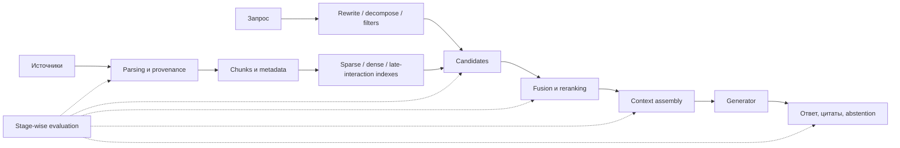

# Retrieval и RAG: карта модуля и источники

RAG начинается не с vector database. Ошибка может возникнуть при parsing,
indexing, query formulation, candidate retrieval, reranking, context assembly
или generation. Поэтому каждый этап должен оставлять проверяемый артефакт.

## Двадцать уроков

1. Почему retrieval вообще нужен и когда достаточно long context.
2. Inverted index, TF-IDF и BM25.
3. Ranking metrics: recall@k, MRR, MAP и nDCG.
4. Dual encoders и contrastive loss.
5. In-batch и hard negatives, domain shift.
6. Cross-encoders и reranking.
7. ColBERT и late interaction.
8. Parsing, provenance и document structure.
9. Fixed, semantic, hierarchical и proposition chunking.
10. Индексы, approximate search, update/delete/versioning.
11. Query rewriting, decomposition, multi-query и HyDE.
12. Hybrid retrieval, filters, fusion и RRF.
13. Context packing, diversity, ordering и compression.
14. Grounding, citations, abstention и claim→evidence trace.
15. Original RAG, FiD, RETRO и Atlas.
16. Self-RAG, CRAG и retrieval как agent action.
17. Multimodal, SQL, graph и structured retrieval.
18. Stage-wise evaluation и error analysis.
19. Production: ACL, freshness, caching, observability, latency и cost.
20. Security: prompt injection, exfiltration и corpus poisoning.

## Учебный позвоночник

- [Jurafsky & Martin, SLP3, Chapter 11](https://web.stanford.edu/~jurafsky/slp3/11.pdf) —
  классический IR, ranking и переход к RAG.
- [Stanford CS124](https://web.stanford.edu/class/cs124/lec/) — лекционная
  траектория по information retrieval.
- [Princeton/ACL OpenQA Tutorial](https://github.com/danqi/acl2020-openqa-tutorial) —
  retriever-reader, DPR, negatives, recall@k и QA evaluation.
- [Stanford CS329T 2025, Lecture 2](https://web.stanford.edu/class/cs329t/slides/Lecture%202%20-%20CS%20329T%20Fall%202025.pdf) —
  прикладная постановка grounding и product evaluation.

Порядок принципиален: BM25 и ranking metrics идут **до** embeddings. Иначе
читатель изучает API vector database, не понимая задачу поиска.

## Первичные архитектуры

| Источник | Что изучаем | Состояние кода |
|---|---|---|
| [DPR](https://arxiv.org/abs/2004.04906) | dual encoder, in-batch negatives | [official](https://github.com/facebookresearch/DPR), исторический |
| [RAG](https://arxiv.org/abs/2005.11401) | RAG-Sequence/RAG-Token и latent documents | paper как canonical claim |
| [FiD](https://arxiv.org/abs/2007.01282) | independent passage encoding, fusion in decoder | [official](https://github.com/facebookresearch/FiD), исторический |
| [ColBERT](https://arxiv.org/abs/2004.12832) | token-level MaxSim и late interaction | [repo](https://github.com/stanford-futuredata/ColBERT), runnable API |
| [Atlas](https://arxiv.org/abs/2208.03299) | joint retriever-LM training и index refresh | repo больше не поддерживается |
| [Self-RAG](https://arxiv.org/abs/2310.11511) | retrieve-or-not и reflection tokens | research architecture |
| [Corrective RAG](https://arxiv.org/abs/2401.15884) | retrieval grading и corrective actions | research architecture |

## Практика

- [FAISS wiki](https://github.com/facebookresearch/faiss/wiki) — Flat, IVF, PQ,
  GPU и recall/latency/memory trade-offs.
- [HF RAG Evaluation cookbook](https://huggingface.co/learn/cookbook/en/rag_evaluation) —
  notebook и evaluation-driven development.
- [DeepLearning.AI: RAG](https://www.deeplearning.ai/alpha/courses/retrieval-augmented-generation-rag) —
  последовательность практической сборки.
- [Advanced RAG](https://www.deeplearning.ai/short-courses/building-evaluating-advanced-rag/) —
  sentence windows, auto-merging и RAG triad; чужие схемы не копируем.
- [Full Stack Deep Learning](https://fullstackdeeplearning.com/llm-bootcamp/spring-2023/) —
  augmented LMs, deployment и sourced-QA walkthrough; API считать устаревающими.
- [Berkeley LLM Agents](https://rdi.berkeley.edu/llm-agents/f24) — retrieval как
  действие агента и современные reading lists.

Практикум сначала реализует BM25, dense retrieval, fusion и reranking без
LangChain/LlamaIndex. Framework появляется только после intermediate metrics.

## Evaluation по этапам

| Слой | Вопрос | Метрики и артефакты |
|---|---|---|
| Corpus | evidence вообще индексирован? | coverage, freshness, parse errors |
| Retrieval | evidence попал в candidates? | recall@k, MRR, nDCG |
| Reranking | evidence вошёл в context budget? | nDCG, pairwise accuracy |
| Context | evidence не потерян при packing? | context recall, redundancy |
| Answer | claims поддержаны evidence? | citation precision, faithfulness |
| Product | ответ полезен и соблюдает SLO? | task success, abstention, p95, cost |

Источники для отдельной главы об evaluation:

- [RAGAS](https://arxiv.org/abs/2309.15217) и
  [library](https://github.com/explodinggradients/ragas) — context precision/
  recall, faithfulness и answer relevance; обсуждаем judge bias.
- [ARES](https://github.com/stanford-futuredata/ARES) — automated evaluation.
- [TREC RAG 2026](https://trec-rag.github.io/) — отдельные retrieval и grounded
  generation tasks с воспроизводимыми test collections.
- [CRAG benchmark](https://github.com/facebookresearch/CRAG) — dynamic и
  long-tail factual queries.
- [BRIGHT](https://arxiv.org/abs/2407.12883) — retrieval, требующий reasoning.

## Обязательные визуалы

1. Corpus explorer: document → parsed blocks → chunks → metadata.
2. Compare mode BM25/dense/hybrid на одном запросе.
3. One-vector retrieval против ColBERT MaxSim matrix.
4. Кликабельный pipeline с метрикой и failure artifact на каждом этапе.
5. Claim→citation→source-span trace для финального ответа.
6. Dashboard, показывающий downstream-эффект изменения retrieval stage.

Условия использования внешних assets:
[[02 Areas/ML & DL/05 Источники/Визуальные материалы и лицензии]].

## Quality gate

Читатель должен уметь вручную посчитать BM25 и contrastive loss; объяснить,
когда sparse поиск сильнее dense; различить bi-encoder, cross-encoder и late
interaction; выбрать chunking после создания eval set; локализовать ошибку по
этапам; обеспечить provenance, ACL, freshness и deletion; проверить injection
и poisoning; сравнить качество вместе с latency, memory и cost.

Текущие вводные главы:
[[02 Areas/ML & DL/00 Учебник/15 Embeddings, Retrieval и RAG/01 Embeddings и retrieval]] и
[[02 Areas/ML & DL/00 Учебник/15 Embeddings, Retrieval и RAG/02 RAG как система]].
