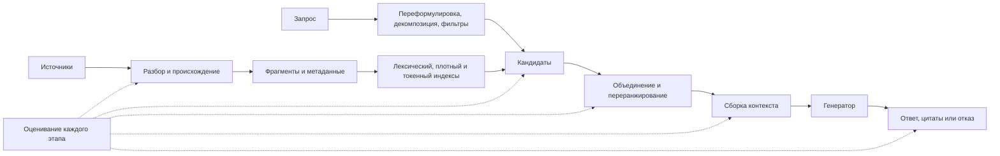

# Поиск и RAG: карта модуля и источники

RAG начинается не с выбора векторной базы, а с определения того, какое
доказательство должен найти и процитировать ответ. Источник может потеряться при
разборе документа, разбиении, индексировании, формулировке запроса, поиске,
переранжировании или сборке контекста. Поэтому каждый этап должен оставлять
проверяемый результат, по которому можно локализовать ошибку.

## Двадцать уроков

1. Зачем нужен поиск и когда достаточно передать весь длинный контекст.
2. Инвертированный индекс, TF–IDF и BM25.
3. Метрики порядка: recall@k, MRR, MAP и nDCG.
4. Двухбашенные модели и contrastive loss.
5. Отрицательные примеры внутри пакета, трудные отрицательные и сдвиг домена.
6. Cross-encoder и переранжирование.
7. ColBERT и позднее токенное взаимодействие.
8. Разбор документов, происхождение и сохранение структуры.
9. Фиксированное, семантическое, иерархическое и пропозициональное разбиение.
10. Приближённые индексы, обновление, удаление и версионирование.
11. Переформулировка, декомпозиция, несколько запросов и HyDE.
12. Гибридный поиск, фильтры, объединение и RRF.
13. Укладка контекста, разнообразие, порядок и сжатие.
14. Опора на источник, цитаты, отказ и связь утверждения с доказательством.
15. Исходный RAG, FiD, RETRO и Atlas.
16. Self-RAG, corrective RAG и поиск как действие агента.
17. Мультимодальный поиск, SQL, графы и структурированные источники.
18. Оценивание каждого этапа и разбор ошибок.
19. Эксплуатация: права, свежесть, кеширование, наблюдаемость, задержка и стоимость.
20. Безопасность: внедрение инструкций, утечка и отравление корпуса.

## Учебный позвоночник

- [Jurafsky & Martin, SLP3, Chapter 11](https://web.stanford.edu/~jurafsky/slp3/11.pdf) —
  классический IR, ranking и переход к RAG.
- [Stanford CS124](https://web.stanford.edu/class/cs124/lec/) — лекционная
  траектория по information retrieval.
- [Princeton/ACL OpenQA Tutorial](https://github.com/danqi/acl2020-openqa-tutorial) —
  retriever-reader, DPR, negatives, recall@k и QA evaluation.
- [Stanford CS329T 2025, Lecture 2](https://web.stanford.edu/class/cs329t/slides/Lecture%202%20-%20CS%20329T%20Fall%202025.pdf) —
  прикладная постановка grounding и product evaluation.

Порядок принципиален: BM25 и метрики ранжирования идут **до** эмбеддингов. Иначе
читатель осваивает интерфейс векторной базы, не понимая, какую задачу поиска она
решает и где теряет доказательства.

## Первичные архитектуры

| Источник | Что изучаем | Состояние кода |
|---|---|---|
| [DPR](https://arxiv.org/abs/2004.04906) | dual encoder, in-batch negatives | [official](https://github.com/facebookresearch/DPR), исторический |
| [RAG](https://arxiv.org/abs/2005.11401) | RAG-Sequence/RAG-Token и latent documents | paper как canonical claim |
| [FiD](https://arxiv.org/abs/2007.01282) | independent passage encoding, fusion in decoder | [official](https://github.com/facebookresearch/FiD), исторический |
| [ColBERT](https://arxiv.org/abs/2004.12832) | token-level MaxSim и late interaction | [repo](https://github.com/stanford-futuredata/ColBERT), runnable API |
| [Atlas](https://arxiv.org/abs/2208.03299) | joint retriever-LM training и index refresh | repo больше не поддерживается |
| [Self-RAG](https://arxiv.org/abs/2310.11511) | retrieve-or-not и reflection tokens | research architecture |
| [Corrective RAG](https://arxiv.org/abs/2401.15884) | retrieval grading и corrective actions | research architecture |

## Практика

- [FAISS wiki](https://github.com/facebookresearch/faiss/wiki) — Flat, IVF, PQ,
  GPU и recall/latency/memory trade-offs.
- [HF RAG Evaluation cookbook](https://huggingface.co/learn/cookbook/en/rag_evaluation) —
  notebook и evaluation-driven development.
- [DeepLearning.AI: RAG](https://www.deeplearning.ai/alpha/courses/retrieval-augmented-generation-rag) —
  последовательность практической сборки.
- [Advanced RAG](https://www.deeplearning.ai/short-courses/building-evaluating-advanced-rag/) —
  sentence windows, auto-merging и RAG triad; чужие схемы не копируем.
- [Full Stack Deep Learning](https://fullstackdeeplearning.com/llm-bootcamp/spring-2023/) —
  augmented LMs, deployment и sourced-QA walkthrough; API считать устаревающими.
- [Berkeley LLM Agents](https://rdi.berkeley.edu/llm-agents/f24) — retrieval как
  действие агента и современные reading lists.

В практикуме сначала реализуются BM25, плотный поиск, объединение списков и
переранжирование без LangChain или LlamaIndex. Каркас приложения появляется
лишь после того, как становятся видны промежуточные показатели.

## Оценивание по этапам

| Слой | Вопрос | Метрики и артефакты |
|---|---|---|
| Корпус | доказательство вообще индексировано? | покрытие, свежесть, ошибки разбора |
| Поиск | доказательство попало в кандидаты? | recall@k, MRR, nDCG |
| Переранжирование | доказательство вошло в бюджет контекста? | nDCG, точность на парах |
| Контекст | доказательство не потерялось при укладке? | полнота контекста, повторы |
| Ответ | утверждения поддержаны источниками? | точность цитат, верность источнику |
| Продукт | ответ полезен и укладывается в SLO? | успешность задачи, отказы, p95, стоимость |

Источники для отдельной главы об evaluation:

- [RAGAS](https://arxiv.org/abs/2309.15217) и
  [library](https://github.com/explodinggradients/ragas) — context precision/
  recall, faithfulness и answer relevance; обсуждаем judge bias.
- [ARES](https://github.com/stanford-futuredata/ARES) — automated evaluation.
- [TREC RAG 2026](https://trec-rag.github.io/) — отдельные retrieval и grounded
  generation tasks с воспроизводимыми test collections.
- [CRAG benchmark](https://github.com/facebookresearch/CRAG) — dynamic и
  long-tail factual queries.
- [BRIGHT](https://arxiv.org/abs/2407.12883) — retrieval, требующий reasoning.

## Обязательные визуалы

1. Corpus explorer: document → parsed blocks → chunks → metadata.
2. Compare mode BM25/dense/hybrid на одном запросе.
3. One-vector retrieval против ColBERT MaxSim matrix.
4. Кликабельный pipeline с метрикой и failure artifact на каждом этапе.
5. Claim→citation→source-span trace для финального ответа.
6. Dashboard, показывающий downstream-эффект изменения retrieval stage.

Условия использования внешних assets:
[[02 Areas/ML & DL/05 Источники/Визуальные материалы и лицензии]].

## Требования к завершённому модулю

После модуля можно будет вручную рассчитать BM25 и contrastive loss;
объяснить, когда лексический поиск сильнее плотного; различить двухбашенную
модель, cross-encoder и позднее взаимодействие; выбирать разбиение после
создания оценочного набора; локализовать ошибку по этапам; обеспечить
происхождение, права доступа, свежесть и удаление; проверить внедрение инструкций
и отравление корпуса; сопоставить качество с задержкой, памятью и стоимостью.

Текущие вводные главы:
[[02 Areas/ML & DL/00 Учебник/15 Embeddings, Retrieval и RAG/01 Embeddings и retrieval]] и
[[02 Areas/ML & DL/00 Учебник/15 Embeddings, Retrieval и RAG/02 RAG как система]].
