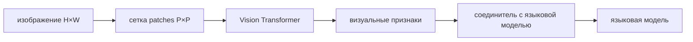

# Мультимодальные модели: изображение, видео и звук

> [!abstract] После этой главы
> Вы сможете проследить путь изображения от пикселей до токенов языковой модели,
> сравнить projector, resampler и cross-attention, рассчитать число визуальных
> токенов и объяснить динамическое разрешение. Отдельные разделы посвящены видео,
> звуку, генерации других модальностей и корректной проверке OCR, координат и
> временного порядка.

## 1. Задача согласования модальностей

Текстовая модель получает дискретные токены одного словаря. Изображение — это
сетка пикселей, звук — временной сигнал, видео — последовательность кадров.
Мультимодальная система должна решить три задачи:

1. представить вход каждой модальности последовательностью признаков;
2. связать эти признаки с языковым пространством;
3. сохранить сведения о положении и времени, необходимые для ответа.

Слово *multimodal* не описывает конкретную архитектуру. Две модели могут
принимать изображение и текст, но одна вставляет визуальные токены прямо в
языковой поток, другая хранит отдельную визуальную память, а третья обучает
единый backbone на нескольких типах токенов.

## 2. Изображение как последовательность patches

Vision Transformer делит изображение размера $H\times W$ на квадраты
$P\times P$. Число фрагментов

$$
N=\frac HP\frac WP.
$$

Каждый фрагмент разворачивается в вектор, линейно проецируется и получает
позиционное представление. Для изображения $336\times336$ и patch size 14

$$
N=24\cdot24=576.
$$

Это уже 576 визуальных токенов до возможного добавления специальных токенов или
нескольких масштабов. Изображение 1344×1344 при том же размере patch дало бы
9216 токенов — квадратичная стоимость полного внимания быстро становится
неприемлемой.



## 3. Предобученный vision encoder

Часто используется ViT, заранее обученный связывать изображения и подписи, как
в CLIP. Контрастивная задача располагает соответствующие изображение и текст
ближе в общем пространстве:

$$
\mathcal L_{i\to t}=-\log
\frac{\exp(s(v_i,t_i)/\tau)}
{\sum_j\exp(s(v_i,t_j)/\tau)}.
$$

Такой encoder хорошо выделяет семантические объекты, но его глобальная задача
не гарантирует чтение мелкого текста, точные координаты или подсчёт одинаковых
предметов. Способности дальнейшей VLM ограничиваются тем, какие сведения
сохранились в визуальных признаках.

## 4. LLaVA: простой проектор между ViT и LLM

В LLaVA визуальный encoder и языковая модель соединяются обучаемой линейной
проекцией или MLP:

$$
z_i^{lang}=W_2\,\sigma(W_1z_i^{vision}).
$$

Полученные векторы имеют ту же размерность, что и текстовые embeddings, и
вставляются в последовательность на место специального маркера изображения.

```text
<user> Что изображено? <image_start> v1 v2 ... v576 <image_end>
<assistant> ...
```

Первый этап обучения согласует visual projector с языковой моделью на парах
изображение–подпись. Затем instruction tuning учит отвечать на мультимодальные
запросы. В разных версиях часть компонентов может быть заморожена или
дообучаться совместно.

Сила схемы — простота: языковая модель работает с визуальными признаками почти
как с дополнительными токенами. Недостаток — все визуальные токены занимают
контекст и участвуют в самовнимании.

## 5. Resampler и фиксированное число визуальных токенов

Perceiver Resampler в Flamingo принимает переменное число визуальных признаков
и с помощью cross-attention преобразует их в фиксированный набор латентных
векторов. Обучаемые запросы $R$ читают признаки изображения $Z$:

$$
R'=\operatorname{Attention}(Q=R,K=Z,V=Z).
$$

Если исходное изображение дало 1024 patches, а resampler возвращает 64 токена,
языковая часть получает предсказуемую стоимость. Однако сжатие может потерять
мелкие детали; латентные запросы должны научиться выбирать информацию, полезную
для разных вопросов.

В Q-Former семейства BLIP-2 похожую роль выполняют обучаемые query tokens,
связанные с замороженным image encoder и языковой моделью.

## 6. Cross-attention вместо единого потока

В Flamingo визуальные представления хранятся отдельно, а между слоями
замороженной языковой модели вставляются блоки gated cross-attention. Текстовые
состояния служат запросами, визуальная память — ключами и значениями:

$$
h'=h+\tanh(\alpha)\operatorname{CrossAttn}(h,Z).
$$

Обучаемый gate, инициализированный около нуля, позволяет начать с поведения
исходной LLM и постепенно подключать зрение.

Отдельная память удобна для чередующихся изображений и текста и не заставляет
визуальные токены участвовать во всех текстовых связях. Но архитектура требует
специальных блоков и уже не является обычной decoder-only LLM с новым
projector.

## 7. Динамическое разрешение

Фиксированное уменьшение изображения до квадрата может уничтожить мелкий текст
или исказить широкую страницу. Современные VLM используют несколько подходов:

- сохраняют исходное соотношение сторон и создают переменное число patches;
- делят крупное изображение на tiles и добавляют уменьшенный общий обзор;
- применяют window attention в vision encoder;
- сжимают или отбрасывают визуальные токены после кодирования;
- выделяют больше токенов областям с мелкими деталями.

Qwen2-VL и Qwen2.5-VL сопоставляют разным разрешениям разное число визуальных
токенов. Это лучше сохраняет исходный масштаб, но делает стоимость запроса
зависимой от изображения. Серверу нужны ограничения `min_pixels/max_pixels`,
иначе одна большая страница может занять почти весь контекст.

### Пространственные позиции

Одномерная позиция в языковой последовательности не выражает двумерную
геометрию. Используют раздельные координаты строки и столбца, двумерные
позиционные embeddings или мультимодальный RoPE. Для задач локализации модель
может генерировать координаты как числа, дискретные токены или структурированный
JSON.

Нормировка координат должна быть согласована с изменением размера, padding и
tiling. Иначе правильная рамка в координатах tile указывает не туда на исходном
изображении.

## 8. OCR и документы

Распознавание текста требует одновременно увидеть символы, порядок чтения и
структуру страницы. Высокая точность подписи к фотографии почти ничего не
говорит о счетах, таблицах или мелком шрифте.

Для документов следует отдельно проверять:

- распознавание символов и чисел;
- порядок блоков и колонок;
- связь ячейки с заголовком строки и столбца;
- точные координаты найденного текста;
- устойчивость к повороту, масштабу и качеству скана;
- сохранение структуры в JSON или Markdown.

Внешний OCR иногда надёжнее end-to-end VLM, особенно когда нужен полный текст с
координатами. Мультимодальная модель затем может рассуждать над результатом OCR,
но происхождение каждого поля должно оставаться проверяемым.

## 9. Видео: пространство плюс время

Наивное кодирование каждого кадра создаёт огромную последовательность. Видео
длительностью минуту при 2 кадрах в секунду и 256 токенах на кадр даёт 30 720
визуальных токенов ещё до текста.

Системы уменьшают стоимость:

- выбирают кадры с фиксированной или динамической частотой;
- сжимают каждый кадр и затем временную последовательность;
- используют tubelets, охватывающие область сразу в нескольких кадрах;
- строят иерархию коротких клипов и общего представления;
- извлекают события или ключевые кадры до языковой модели.

Нужно сохранить не только порядок, но и физическое время. В Qwen2.5-VL
динамическая частота кадров сочетается с абсолютным временным кодированием, чтобы
модель могла связывать события с временными отметками.

Проверка видео должна включать перестановку кадров, удаление ключевого кадра и
вопросы о времени события. Иначе модель может отвечать по отдельному кадру или
по языковым предположениям, не понимая динамику.

## 10. Звук и речь

Аудиосигнал обычно преобразуется в спектрограмму или кодируется обученным audio
encoder. Фрагменты времени становятся последовательностью признаков, которую
projector или cross-attention связывает с LLM.

Задачи различаются:

- автоматическое распознавание речи требует точной последовательности слов;
- понимание аудио включает события, музыку и фоновые звуки;
- диалог в реальном времени требует потоковой обработки и малой задержки;
- синтез речи должен сохранить содержание, голос, просодию и временную структуру.

Текстовая расшифровка теряет интонацию, паузы и неязыковые звуки. С другой
стороны, прямое аудио занимает больше токенов и усложняет обучение. Omni-модель
может сочетать оба представления.

## 11. Понимание и генерация — разные декодеры

Модель, отвечающая текстом об изображении, не обязана уметь создавать
изображение. Для генерации нужны выходные представления другой модальности:

- дискретные коды изображения и авторегрессионный decoder;
- diffusion decoder, обусловленный состояниями мультимодальной модели;
- аудиокодеки и последовательность акустических токенов;
- отдельный синтезатор речи по тексту и признакам голоса.

«Native omni» может означать общий backbone, общий поток токенов или просто
совместное end-to-end обучение нескольких encoders и decoders. При описании
архитектуры нужно перечислять реальные границы компонентов.

## 12. Этапы обучения

Типичная схема включает:

1. предобучение encoder соответствующей модальности;
2. согласование connector на парах изображение–текст или аудио–текст;
3. мультимодальное предобучение на больших смешанных данных;
4. instruction tuning на диалогах и задачах;
5. обучение предпочтениям, безопасности и использованию инструментов;
6. отдельную настройку генеративных decoders, если модель создаёт медиа.

Качество данных определяет grounding. Подписи учат распознавать объекты, но не
обязательно координаты; ответы VQA могут поощрять угадывание по языковым
частотам; синтетические инструкции наследуют ошибки учителя.

## 13. Как доказать, что модель использует изображение

Высокий общий результат допускает языковые shortcuts. Полезны контрфактические
проверки:

- заменить изображение при неизменном вопросе;
- переставить две похожие области;
- скрыть объект, необходимый для ответа;
- изменить только число, подпись или цвет;
- сравнить ответ с моделью, получившей один текст;
- потребовать координаты и проверить их программно.

Для OCR используется character/word error rate, для detection — IoU и
локализационные метрики, для видео — временной IoU, для речи — WER. Оценка
языковой моделью не заменяет эти исполнимые проверки.

## 14. Основные сбои

### Потеря мелких деталей

Изображение слишком уменьшено или resampler сжал тысячи patches в несколько
токенов. Проверяйте качество по размеру объекта и числу визуальных токенов.

### Галлюцинация по языковому prior

Модель отвечает правдоподобно, не опираясь на вход. Контрфактическая замена
изображения показывает, меняется ли ответ.

### Неверная геометрия

Модель узнаёт объекты, но путает лево/право, пересечения и координаты. Нужны
специальные данные и исполнимая проверка рамок.

### Временная слепота

Модель видит набор кадров, но не порядок событий. Проверяйте перестановкой и
вопросами «до/после».

### Цена модальности

Большое изображение или видео занимает контекст, повышает TTFT и вытесняет
текстовую историю. Логируйте число визуальных и аудиотокенов отдельно.

## 15. Практикум

1. Рассчитайте число patches для трёх разрешений и стоимость полного внимания.
2. Реализуйте MLP-projector между готовым ViT и маленькой LLM; заморозьте оба
   backbone и обучите только соединитель.
3. Сравните все patch tokens с resampler на 32 и 64 латентных вектора по OCR и
   общему VQA.
4. Создайте набор изображений, различающихся одним числом или положением
   объекта, и проведите контрфактическую проверку.
5. Для документа измерьте OCR, структуру таблицы и точность ответа отдельно.
6. Для видео сравните равномерный выбор кадров и выбор по сценам при одинаковом
   числе токенов.
7. Запишите манифест: encoder, разрешение, patch size, connector, число
   визуальных токенов, версию LLM и этапы совместного обучения.

## 16. Объяснения и первоисточники

### Наглядные материалы и реализации

- Jay Alammar, [The Illustrated Stable Diffusion](https://jalammar.github.io/illustrated-stable-diffusion/) — наглядное разделение текстового кодировщика, латентного пространства и генеративного decoder.
- [LLaVA repository](https://github.com/haotian-liu/LLaVA) — простой projector и visual instruction tuning.
- Qwen Team, [Qwen2.5-VL overview](https://qwenlm.github.io/blog/qwen2.5-vl/) — динамическое разрешение, временное кодирование, OCR и локализация.
- [OpenFlamingo](https://github.com/mlfoundations/open_flamingo) — открытая реализация resampler и gated cross-attention.

### Первоисточники

- Radford et al., [Learning Transferable Visual Models From Natural Language Supervision](https://arxiv.org/abs/2103.00020) — CLIP.
- Alayrac et al., [Flamingo: a Visual Language Model for Few-Shot Learning](https://arxiv.org/abs/2204.14198).
- Li et al., [BLIP-2: Bootstrapping Language-Image Pre-training with Frozen Image Encoders and Large Language Models](https://arxiv.org/abs/2301.12597).
- Liu et al., [Visual Instruction Tuning](https://arxiv.org/abs/2304.08485) — LLaVA.
- Bai et al., [Qwen2.5-VL Technical Report](https://arxiv.org/abs/2502.13923).

> [!summary] Главное
> Мультимодальная модель определяется не перечнем допустимых файлов, а тем, как
> каждая модальность кодируется, сжимается, позиционируется и связывается с
> языком. Число визуальных токенов задаёт цену, а отдельные проверки OCR,
> координат и времени показывают, сохранилась ли нужная информация.
