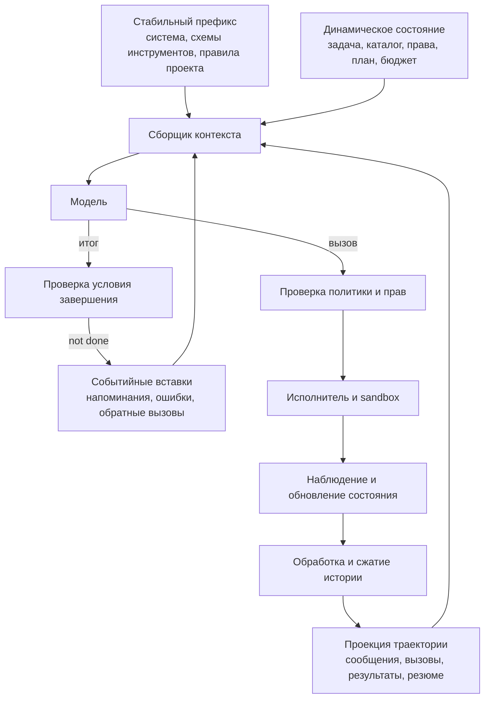

# Исполняющая среда агента и управление контекстом

Языковая модель предлагает следующее сообщение. Исполняющая среда, или
*harness*, превращает её в систему, которая может действовать в несколько
шагов, пользоваться инструментами, сохранять состояние, восстанавливаться после
ошибок и проверять, действительно ли задача выполнена.

> [!important] О «токенах-напоминаниях»
> Выражение `reminder tokens` удобно в разговоре, но технически неточно. Обычно
> речь идёт не о специальных токенах словаря и не об отдельном механизме модели.
> Harness динамически добавляет обычное сообщение с целью, ограничением или
> изменившимся состоянием. В англоязычных источниках встречаются термины
> *reminder injection*, *dynamic system reminder* и *context reinforcement*.

## Модель, агент, процесс и исполняющая среда

| Слой | Ответственность | Чего он не гарантирует |
|---|---|---|
| Модель | предлагает текст, решение или вызов инструмента | что действие разрешено и выполнено |
| Стратегия агента | выбирает следующий шаг из текущего контекста | сохранность состояния вне окна |
| Процесс | задаёт заранее определённый граф шагов | адаптацию за пределами графа |
| Harness | собирает контекст, ведёт цикл, инструменты, состояние, пределы и журнал | правильность каждого решения модели |
| Среда | хранит фактическое состояние файлов, сервисов и мира | что модель верно его интерпретирует |
| Оценочная среда | запускает попытки и проверки | совпадение с производственной средой без отдельной проверки |

## Центральная схема



Критическая граница проходит вне модели: изоляция, права, идемпотентность,
бюджеты и детерминированная проверка обеспечиваются управляющей программой, а
не просьбой в prompt.

## Двадцать четыре урока

### I. Исполняющая среда

1. Модель, агент, заранее заданный процесс и harness — разные уровни.
2. Минимальный цикл «модель → инструмент → наблюдение».
3. Сборка сообщений: роли, стабильный префикс и динамический суффикс.
4. Проектирование интерфейса инструментов: схемы, проверка, ошибки, страницы и объём вывода.
5. Состояние среды: файлы, рабочий каталог, процессы, контейнеры и контрольные точки.
6. Условия завершения: успех, блокировка, передача задачи и человеческое решение.

### II. Управление выполнением

7. Ограничения шагов, вызовов, токенов, стоимости и времени; корректная остановка.
8. Повторы модели и инструментов, задержка между попытками и классификация ошибок.
9. Частичные побочные эффекты, ключи идемпотентности и компенсация.
10. Права, sandbox, подтверждение действий и участие человека.
11. Планы, состояние задач, hooks, промежуточные обработчики и обратные вызовы.
12. Подагенты: делегирование, изоляция контекста, параллельность и конфликты изменений.

### III. Контекст и память

13. Сборщик контекста и полезный сигнал на один токен.
14. Деградация контекста: позиция, отвлекающие фрагменты и устаревшее состояние.
15. Обрезка, детерминированное исключение и очистка старых результатов инструментов.
16. Семантическое сжатие и проверка сохранности смысла.
17. Состояние сессии, артефакты и авторитетные контрольные точки.
18. Семантическая, эпизодическая и процедурная память; реактивное и упреждающее извлечение.
19. Событийные напоминания: триггер, содержание, срок, удаление повторов и приоритет.
20. Длительные сессии, передача в свежий контекст и восстановление.

### IV. Доказательность

21. Полный журнал, активный контекст и долговременная стенограмма — разные объекты.
22. Проверка конечного результата и проверка траектории.
23. Исключение компонентов harness, разброс, снимки среды и совпадение с benchmark.
24. Безопасность: внедрение инструкций через prompt и инструменты, поддельные теги и отравление памяти.

## Reminder injections подробно

Напоминание — это правило повторной подачи состояния, необходимого для решения.

```text
событие → правило срабатывания → выбор содержания → удаление повторов
        → назначение роли → вставка в нужный момент → истечение или обновление
```

### Что может вызвать reminder

- переход между планированием и исполнением;
- завершение инструмента или ошибка;
- изменение прав;
- отсутствие ожидаемого отчёта о ходе работы;
- приближение контекста к порогу сжатия;
- завершение подагента;
- попытка остановиться без доказательства выполнения;
- изменение файла, процесса или состояния проверки во внешней среде.

### Что измерять

| Свойство | Почему важно |
|---|---|
| Точность и полнота срабатываний | редкие напоминания не помогают, частые загрязняют контекст |
| Добавленные входные токены | каждое напоминание имеет стоимость |
| Влияние на кеш prompt | изменение стабильного префикса может нарушить переиспользование кеша |
| Следование сообщению | модель может проигнорировать текст |
| Итог задачи | локальное послушание не равно успешному результату |
| Лишнее вмешательство | напоминание способно увести верную траекторию в сторону |

### Напоминание не является механизмом принуждения

Строка `<system-reminder>` сама по себе не создаёт границу доверия. Недоверенная
веб-страница или результат инструмента способны напечатать такой же тег.
Авторитет задаётся ролью сообщения и происхождением вне текста. Опасное действие
запрещает проверка прав или sandbox, а не повторение запрета модели.

Свежая работа [Remember When It Matters](https://arxiv.org/abs/2607.08716)
изучает selective memory-grounded reminders и сообщает улучшения на
Terminal-Bench 2.0 и tau2-Bench. Это июльский preprint 2026 года: используем как
перспективный результат, а не универсально доказанную норму.

## Деградация контекста и управление историей

Контекстное окно не равно памяти, а большой предел не гарантирует надёжного
использования всех помещённых в него токенов.

| Механизм | Что делает | Основной риск |
|---|---|---|
| Обрезка | удаляет старые события | теряет причинную цепочку |
| Очистка результатов | заменяет старые объёмные наблюдения | теряет детали, если источник исчез |
| Детерминированное исключение | оставляет последние N результатов или тегов | не понимает смысловую важность |
| Сжатие | превращает траекторию в резюме и состояние | потеря сведений и вымышленная связность |
| Поиск | возвращает выбранные фрагменты | пропуск и ошибочный порядок |
| Структурированные заметки | сохраняют ход работы вне окна | устаревшая или неполная запись |
| Передача в новую сессию | начинает чистый контекст с артефактами | плохая передача скрывает незавершённое |

Основы:

- [Lost in the Middle](https://aclanthology.org/2024.tacl-1.9/) — позиционная
  деградация использования длинного контекста.
- [Chroma: Context Rot](https://www.trychroma.com/research/context-rot) —
  контролируемые эксперименты на разных моделях; пороги не универсальны.
- [Anthropic: Effective context engineering](https://www.anthropic.com/engineering/effective-context-engineering-for-ai-agents) —
  сжатие, структурированные заметки и изоляция контекста через подагентов.
- [Self-Compacting Language Model Agents](https://arxiv.org/abs/2606.23525) —
  свежая работа об adaptive compaction; помечать emerging.

## Основные курсы и объяснения

- [Hugging Face Context Engineering Course](https://huggingface.co/learn/context-course/unit0/introduction) —
  skills, MCP, плагины, подагенты, hooks и Nano Harness; практический курс.
- [Stanford CS329A: Self-Improving AI Agents](https://cs329a.stanford.edu/) —
  инструменты, память, оркестрация, поиск, RL и устойчивое оценивание.
- [Hugging Face Agents Course](https://huggingface.co/learn/agents-course/unit0/introduction) —
  базовый цикл и фреймворки после самостоятельной реализации.
- [Simon Willison: How coding agents work](https://simonwillison.net/guides/agentic-engineering-patterns/how-coding-agents-work/) —
  ясное практическое введение; не использовать как единственное доказательство.
- [Lilian Weng: LLM Powered Autonomous Agents](https://lilianweng.github.io/posts/2023-06-23-agent/) —
  историческая систематизация планирования, памяти и инструментов; современные детали harness
  обновлять источниками 2025–2026 годов.

## Канонические case studies

### Codex

- [OpenAI: Unrolling the Codex agent loop](https://openai.com/index/unrolling-the-codex-agent-loop/) —
  сборка input, project instructions, skills, environment и permissions.
- [OpenAI: Harness engineering](https://openai.com/index/harness-engineering/) —
  repository legibility, AGENTS.md как карта, feedback loops и verification.
- [Codex compaction source](https://github.com/openai/codex/blob/main/codex-rs/core/src/compact.rs) —
  threshold, summarization prompt, replacement history и reinjection initial context.

### Claude Code / Anthropic

- [Claude Code hooks](https://code.claude.com/docs/en/hooks) — documented
  `additionalContext`, event hooks и compaction lifecycle.
- [Effective harnesses for long-running agents](https://www.anthropic.com/engineering/effective-harnesses-for-long-running-agents) —
  initializer/session split, progress file, git history и incremental verification.
- [Building effective agents](https://www.anthropic.com/engineering/building-effective-agents) —
  workflows и orchestration patterns.

### Минимальные и полные open harnesses

- [mini-SWE-agent](https://github.com/SWE-agent/mini-swe-agent) — линейный
  минимальный loop для построчного разбора.
- [SWE-agent ACI](https://arxiv.org/abs/2405.15793) — влияние interface между
  agent и computer; [history processors](https://swe-agent.com/latest/reference/history_processor_config/).
- [OpenHands](https://github.com/All-Hands-AI/OpenHands) — condensation,
  sandbox, lifecycle, routing и security analysis.
- [LangGraph interrupts](https://docs.langchain.com/oss/python/langgraph/interrupts) —
  checkpoints, resume и HITL.
- [smolagents](https://huggingface.co/docs/smolagents/en/reference/agents) —
  max steps, planning intervals, callbacks, subagents и final checks.

## Среда оценивания

Нельзя сообщать результат модели на benchmark без фиксации harness. Необходимо
указать версию модели, prompts, схемы инструментов, правила контекста и повторов,
бюджеты, образ среды, версию набора данных и проверяющей программы.

- [Anthropic: Demystifying evals for AI agents](https://www.anthropic.com/engineering/demystifying-evals-for-ai-agents) —
  outcomes, trajectories и несколько trials.
- [Inspect AI](https://inspect.aisi.org.uk/agents.html) — agents, limits,
  sandbox, approvals, event logs, checkpoints и interventions.
- [Harbor adapters](https://www.harborframework.com/docs/datasets/adapters) —
  сравнение wrappers, prompt construction, retries, turn limits и tool outputs.
- [AgentBench](https://arxiv.org/abs/2308.03688) и
  [AgentBoard](https://arxiv.org/abs/2401.13178) — environments и progress rate.

## Лабораторная траектория

1. Написать минимальный цикл harness без фреймворка.
2. Добавить типизированный инструмент, проверку и наблюдение.
3. Хранить полный журнал отдельно от активного контекста.
4. Воспроизвести деградацию на растущей зашумлённой траектории.
5. Сравнить последние N сообщений, очистку результатов и семантическое сжатие.
6. Проверить, сохраняет ли сжатие критические факты и незавершённое состояние.
7. Добавить артефакт прогресса и передачу в свежую сессию.
8. Реализовать событийное напоминание со сроком действия и удалением повторов.
9. Показать, что поддельный `<system-reminder>` в результате инструмента не имеет авторитета.
10. Сравнить отсутствие напоминаний, постоянное, выборочное и жёсткое программное ограничение.
11. Добавить бюджеты, повторные попытки и тест идемпотентности.
12. Оценить исход и траекторию в нескольких запусках с разными случайными зернами.

## Формулы, которые нужно запомнить

> [!summary]
> Контекстное окно ≠ память. Стенограмма ≠ состояние задачи. Резюме ≠ источник
> истины. Напоминание ≠ принуждение. Длинный контекст ≠ надёжный контекст.
> Оценка модели ≠ оценка harness.

Связанные главы:
[[02 Areas/ML & DL/00 Учебник/17 Tools и Agents/01 Tool use и agents]] и
[[02 Areas/ML & DL/00 Учебник/17 Tools и Agents/02 Evaluation и воспроизводимость]].
