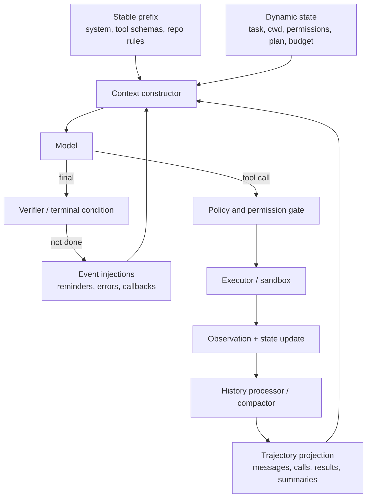

# Agent Harness и Context Engineering

Модель генерирует следующий ответ. Harness превращает её в систему, которая
может действовать несколько шагов, пользоваться инструментами, сохранять
состояние, восстанавливаться после ошибок и доказывать, что задача выполнена.

> [!important] Про reminder tokens
> `Reminder tokens` — разговорное, но неточное название. Обычно это не special
> tokens tokenizer и не отдельная технология модели. Harness динамически
> вставляет короткое сообщение с целью, ограничением, состоянием или памятью;
> оно расходует обычные input tokens. Корректные термины: **reminder injection**,
> **dynamic system reminder**, **context reinforcement**.

## Модель, агент, workflow и harness

| Слой | Ответственность | Чего он не гарантирует |
|---|---|---|
| Model | предлагает текст, решение или tool call | что действие разрешено и выполнено |
| Agent policy | выбирает следующий шаг из текущего контекста | сохранность состояния вне окна |
| Workflow | задаёт заранее определённый граф шагов | адаптацию за пределами графа |
| Harness | собирает context, ведёт loop, tools, state, limits, permissions, trace | правильность каждого решения модели |
| Environment | хранит реальное состояние мира | что модель его верно интерпретировала |
| Eval harness | запускает trials и graders | тождество production harness без parity-check |

## Центральная схема



Критическая граница проходит вне модели: sandbox, permissions, idempotency,
budgets и deterministic verification должны обеспечиваться controller-ом, а
не просьбой в prompt.

## Двадцать четыре урока

### I. Исполняющая среда

1. Model ≠ agent ≠ workflow ≠ harness.
2. Минимальный model→tool→observation loop.
3. Message assembly: roles, stable prefix и dynamic suffix.
4. Tool/ACI design: schemas, validation, errors, pagination и output size.
5. Environment state: files, cwd, processes, containers и checkpoints.
6. Terminal conditions: done, blocked, handoff и human judgment.

### II. Управление выполнением

7. Step/call/token/cost/time budgets и graceful stopping.
8. Model retry, tool retry, backoff и retry classification.
9. Partial side effects, idempotency keys и compensation.
10. Permissions, sandbox, approval, approve/edit/reject и HITL.
11. Plans, todo state, hooks, middleware и callbacks.
12. Subagents: delegation, context isolation, concurrency и merge conflicts.

### III. Контекст и память

13. Context constructor и signal-per-token.
14. Context rot: position, distractors, stale state и behavioral decay.
15. Trimming, deterministic elision и clearing старых tool results.
16. Semantic compaction и проверка fidelity.
17. Session state, artifacts и source-of-truth checkpoints.
18. Semantic, episodic и procedural memory; reactive/proactive recall.
19. Reminder injections: trigger, payload, TTL, dedup и priority.
20. Long-running sessions, fresh-context handoff и recovery.

### IV. Доказательность

21. Trace, active context и durable transcript — три разных объекта.
22. Outcome graders и trajectory graders.
23. Harness ablations, variance, environment snapshots и benchmark parity.
24. Security: prompt/tool injection, fake reminder tags и memory poisoning.

## Reminder injections подробно

Reminder — это политика повторной подачи decision-relevant state.

```text
event → trigger policy → select payload → deduplicate → assign authority/role
      → insert near relevant turn → observe behavior → expire or refresh
```

### Что может вызвать reminder

- смена plan/execute mode;
- tool завершился или вернул ошибку;
- изменился permission state;
- задача потеряла progress update;
- context приблизился к compaction threshold;
- завершился subagent;
- модель пытается остановиться без verification evidence;
- во внешнем мире изменился файл, процесс или review status.

### Что измерять

| Свойство | Почему важно |
|---|---|
| Trigger precision/recall | слишком редкие reminders не помогают, частые загрязняют context |
| Added input tokens | напоминание имеет реальную стоимость каждый раз |
| Prompt-cache effect | изменение stable prefix может разрушать cache reuse |
| Behavioral compliance | модель может проигнорировать текст |
| Task outcome | локальная compliance не равна успешной задаче |
| False intervention | reminder способен увести правильную trajectory в сторону |

### Reminder не является enforcement

Строка `<system-reminder>` сама по себе не создаёт trust boundary. Недоверенный
web/tool output может напечатать такой же тег. Authority должна задаваться
структурой сообщения и provenance вне текста. Запрет опасного действия
обеспечивается permission gate или sandbox, а не повторением запрета модели.

Свежая работа [Remember When It Matters](https://arxiv.org/abs/2607.08716)
изучает selective memory-grounded reminders и сообщает улучшения на
Terminal-Bench 2.0 и tau2-Bench. Это июльский preprint 2026 года: используем как
перспективный результат, а не универсально доказанную норму.

## Context rot и управление историей

`Context window` не равен `memory`, а большой лимит не гарантирует надёжного
использования всех tokens.

| Механизм | Что делает | Основной риск |
|---|---|---|
| Truncation | удаляет старые события | теряет причинную цепочку |
| Tool-result clearing | заменяет старые большие observations | теряет детали, если source исчез |
| Deterministic elision | оставляет последние N результатов/tags | не понимает семантическую важность |
| Compaction | превращает trajectory в summary/state | summary loss и fabricated continuity |
| Retrieval | возвращает выбранные фрагменты | miss и ошибочный ranking |
| Structured notes | сохраняет прогресс вне окна | stale или неполная запись |
| Fresh-session handoff | начинает чистый context с artifacts | плохой handoff скрывает незавершённое |

Основы:

- [Lost in the Middle](https://aclanthology.org/2024.tacl-1.9/) — позиционная
  деградация использования длинного контекста.
- [Chroma: Context Rot](https://www.trychroma.com/research/context-rot) —
  контролируемые эксперименты на разных моделях; пороги не универсальны.
- [Anthropic: Effective context engineering](https://www.anthropic.com/engineering/effective-context-engineering-for-ai-agents) —
  compaction, structured notes и context isolation через subagents.
- [Self-Compacting Language Model Agents](https://arxiv.org/abs/2606.23525) —
  свежая работа об adaptive compaction; помечать emerging.

## Основные курсы и объяснения

- [Hugging Face Context Engineering Course](https://huggingface.co/learn/context-course/unit0/introduction) —
  Skills, MCP, plugins, subagents, hooks и Nano Harness; практический companion.
- [Stanford CS329A: Self-Improving AI Agents](https://cs329a.stanford.edu/) —
  tools, memory, orchestration, search/RL и robust evaluation.
- [Hugging Face Agents Course](https://huggingface.co/learn/agents-course/unit0/introduction) —
  базовый loop и frameworks после реализации from scratch.
- [Simon Willison: How coding agents work](https://simonwillison.net/guides/agentic-engineering-patterns/how-coding-agents-work/) —
  ясное practitioner-введение; не использовать как единственное доказательство.
- [Lilian Weng: LLM Powered Autonomous Agents](https://lilianweng.github.io/posts/2023-06-23-agent/) —
  историческая taxonomy planning/memory/tools; современные harness internals
  обновлять источниками 2025–2026 годов.

## Канонические case studies

### Codex

- [OpenAI: Unrolling the Codex agent loop](https://openai.com/index/unrolling-the-codex-agent-loop/) —
  сборка input, project instructions, skills, environment и permissions.
- [OpenAI: Harness engineering](https://openai.com/index/harness-engineering/) —
  repository legibility, AGENTS.md как карта, feedback loops и verification.
- [Codex compaction source](https://github.com/openai/codex/blob/main/codex-rs/core/src/compact.rs) —
  threshold, summarization prompt, replacement history и reinjection initial context.

### Claude Code / Anthropic

- [Claude Code hooks](https://code.claude.com/docs/en/hooks) — documented
  `additionalContext`, event hooks и compaction lifecycle.
- [Effective harnesses for long-running agents](https://www.anthropic.com/engineering/effective-harnesses-for-long-running-agents) —
  initializer/session split, progress file, git history и incremental verification.
- [Building effective agents](https://www.anthropic.com/engineering/building-effective-agents) —
  workflows и orchestration patterns.

### Минимальные и полные open harnesses

- [mini-SWE-agent](https://github.com/SWE-agent/mini-swe-agent) — линейный
  минимальный loop для построчного разбора.
- [SWE-agent ACI](https://arxiv.org/abs/2405.15793) — влияние interface между
  agent и computer; [history processors](https://swe-agent.com/latest/reference/history_processor_config/).
- [OpenHands](https://github.com/All-Hands-AI/OpenHands) — condensation,
  sandbox, lifecycle, routing и security analysis.
- [LangGraph interrupts](https://docs.langchain.com/oss/python/langgraph/interrupts) —
  checkpoints, resume и HITL.
- [smolagents](https://huggingface.co/docs/smolagents/en/reference/agents) —
  max steps, planning intervals, callbacks, subagents и final checks.

## Evaluation harness

Нельзя сообщать benchmark score модели без фиксации harness. Нужно закрепить:
model/version, prompts, tool schemas, context policy, retry policy, budgets,
environment image, dataset commit и grader version.

- [Anthropic: Demystifying evals for AI agents](https://www.anthropic.com/engineering/demystifying-evals-for-ai-agents) —
  outcomes, trajectories и несколько trials.
- [Inspect AI](https://inspect.aisi.org.uk/agents.html) — agents, limits,
  sandbox, approvals, event logs, checkpoints и interventions.
- [Harbor adapters](https://www.harborframework.com/docs/datasets/adapters) —
  сравнение wrappers, prompt construction, retries, turn limits и tool outputs.
- [AgentBench](https://arxiv.org/abs/2308.03688) и
  [AgentBoard](https://arxiv.org/abs/2401.13178) — environments и progress rate.

## Лабораторная траектория

1. Написать nano harness loop без framework.
2. Добавить typed tool, validation и observation.
3. Хранить полный trace отдельно от active context.
4. Воспроизвести деградацию на растущей noisy trajectory.
5. Сравнить last-N, tool clearing и semantic compaction.
6. Проверить compaction на recall критических facts и unresolved state.
7. Добавить progress artifact и fresh-session handoff.
8. Реализовать event-driven reminder с TTL и dedup.
9. Показать, что fake `<system-reminder>` в tool output не имеет authority.
10. Провести ablation: no reminder / always-on / selective / hard gate.
11. Добавить budgets, retries и idempotency test.
12. Запустить outcome + trajectory evaluation с несколькими seeds/trials.

## Формулы, которые нужно запомнить

> [!summary]
> Context window ≠ memory. Transcript ≠ task state. Summary ≠ source of truth.
> Reminder ≠ enforcement. Long context ≠ reliable context. Model eval ≠ harness eval.

Связанные главы:
[[02 Areas/ML & DL/00 Учебник/17 Tools и Agents/01 Tool use и agents]] и
[[02 Areas/ML & DL/00 Учебник/17 Tools и Agents/02 Evaluation и воспроизводимость]].
