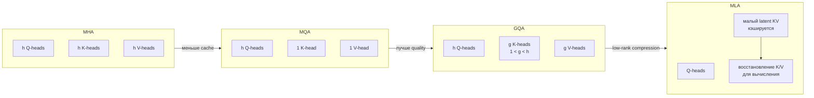

# Эволюция attention и KV-cache

| Вариант | Что хранится на токен | Главный компромисс |
|---|---:|---|
| MHA | K и V каждой головы | максимум гибкости, большой cache |
| MQA | один K/V набор | минимум cache, возможная потеря качества |
| GQA | несколько K/V групп | практический баланс |
| MLA | сжатое latent-представление | сложнее реализация и kernels |

