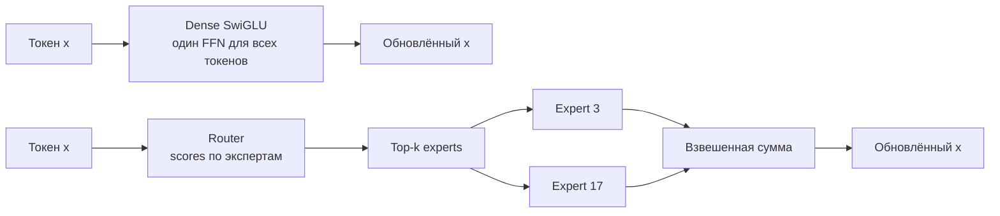

# От dense FFN к Mixture of Experts

MoE увеличивает общее число параметров, не активируя их все для каждого токена.
Экономится compute на токен, но растут память весов, коммуникации и сложность
балансировки экспертов.

