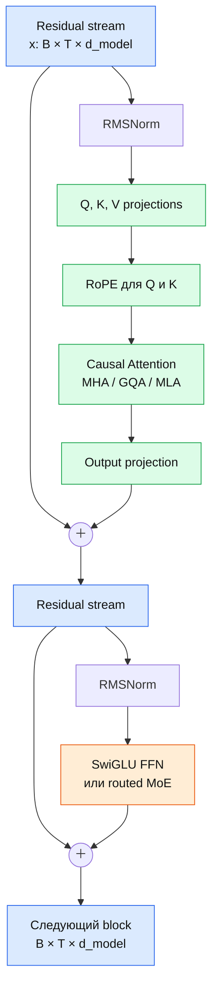

# Современный decoder block

Главная идея: модель не «передаёт токены» между слоями. Она последовательно
обновляет residual stream двумя преобразованиями: attention смешивает информацию
между позициями, FFN преобразует признаки внутри каждой позиции.

