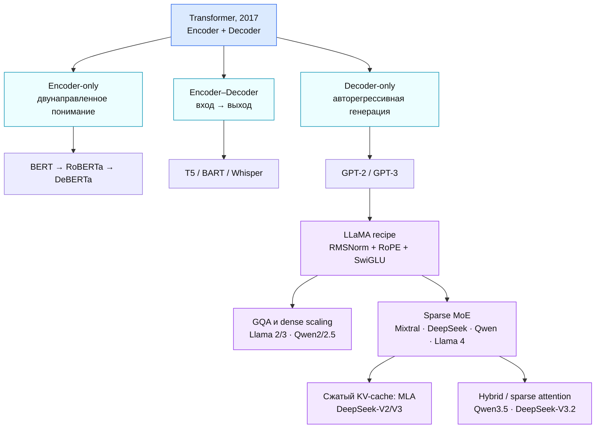

# Карта семейства Transformer

```mermaid
flowchart TD
    T["Transformer, 2017<br/>Encoder + Decoder"] --> E["Encoder-only<br/>двунаправленное понимание"]
    T --> ED["Encoder–Decoder<br/>вход → выход"]
    T --> D["Decoder-only<br/>авторегрессивная генерация"]
    E --> B["BERT → RoBERTa → DeBERTa"]
    ED --> T5["T5 / BART / Whisper"]
    D --> GPT["GPT-2 / GPT-3"]
    GPT --> L["LLaMA recipe<br/>RMSNorm + RoPE + SwiGLU"]
    L --> G["GQA и dense scaling<br/>Llama 2/3 · Qwen2/2.5"]
    L --> M["Sparse MoE<br/>Mixtral · DeepSeek · Qwen · Llama 4"]
    M --> MLA["Сжатый KV-cache: MLA<br/>DeepSeek-V2/V3"]
    M --> H["Hybrid / sparse attention<br/>Qwen3.5 · DeepSeek-V3.2"]

    classDef root fill:#dbeafe,stroke:#2563eb,color:#111;
    classDef branch fill:#ecfeff,stroke:#0891b2,color:#111;
    classDef modern fill:#f3e8ff,stroke:#9333ea,color:#111;
    class T root;
    class E,ED,D branch;
    class L,G,M,MLA,H modern;
```

Карта показывает архитектурное родство. RLHF, DPO, RLVR и thinking mode здесь
не показаны, потому что относятся к post-training, а не к форме блока.

