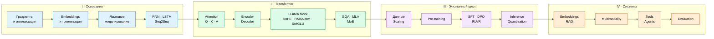

# Учебная карта

```mermaid
flowchart LR
    subgraph F["I · Основания"]
      NN["Градиенты<br/>и оптимизация"] --> TOK["Embeddings<br/>и токенизация"]
      TOK --> LM["Языковое<br/>моделирование"]
      LM --> RNN["RNN · LSTM<br/>Seq2Seq"]
    end
    subgraph T["II · Transformer"]
      ATT["Attention<br/>Q · K · V"] --> TR["Encoder<br/>Decoder"]
      TR --> LL["LLaMA block<br/>RoPE · RMSNorm · SwiGLU"]
      LL --> EF["GQA · MLA<br/>MoE"]
    end
    subgraph L["III · Жизненный цикл"]
      DATA["Данные<br/>Scaling"] --> PRE["Pre-training"]
      PRE --> POST["SFT · DPO<br/>RLVR"]
      POST --> INF["Inference<br/>Quantization"]
    end
    subgraph S["IV · Системы"]
      RET["Embeddings<br/>RAG"] --> MM["Multimodality"]
      MM --> AG["Tools<br/>Agents"]
      AG --> EV["Evaluation"]
    end
    RNN --> ATT
    EF --> DATA
    INF --> RET

    classDef foundation fill:#e0f2fe,stroke:#0284c7,color:#111;
    classDef transformer fill:#dcfce7,stroke:#16a34a,color:#111;
    classDef lifecycle fill:#f3e8ff,stroke:#9333ea,color:#111;
    classDef systems fill:#ffedd5,stroke:#ea580c,color:#111;
    class NN,TOK,LM,RNN foundation;
    class ATT,TR,LL,EF transformer;
    class DATA,PRE,POST,INF lifecycle;
    class RET,MM,AG,EV systems;
```

Карта показывает зависимости: post-training невозможно понять без base LM, а
RAG и agents — это системы поверх модели, не разновидности Transformer.
