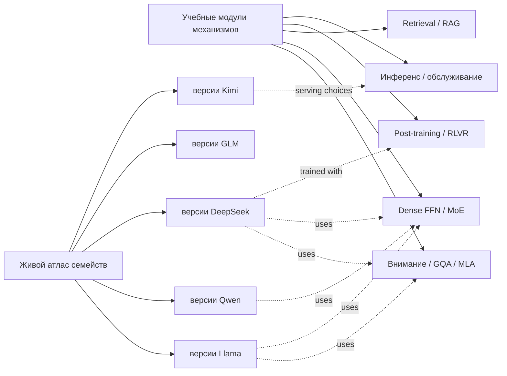

# Карта крупных учебных модулей

Учебник строится не как одна линейная простыня и не как набор карточек. Большая
технология получает собственный модуль из последовательных уроков; семейства
моделей остаются в живом атласе и ссылаются на эти уроки.

## Два независимых измерения

### Механизмы

Отвечают на вопрос **«как работает механизм»**. Примеры: внимание, MoE, RAG,
RLHF и квантизация. Такая глава не привязана к одному семейству моделей.

### Семейства и версии

Отвечают на вопрос **«какую комбинацию механизмов использует конкретная
модель»**. Llama, Qwen, DeepSeek, GLM, Kimi и другие описываются через изменения
между версиями и ссылаются на канонические объяснения механизмов.

## Модуль Mixture of Experts

Каноническая глава [[02 Areas/ML & DL/00 Учебник/09 Dense FFN и Mixture of Experts/01 От SwiGLU к MoE]]
проводит читателя через следующий маршрут:

1. Dense FFN, GLU/SwiGLU и где находятся параметры Transformer.
2. Router как learned conditional computation.
3. Top-1, top-2, expert-choice и soft routing.
4. Load balancing, auxiliary losses, router z-loss и collapse.
5. Capacity factor, token dropping и dropless MoE.
6. Shared и fine-grained experts: DeepSeekMoE.
7. Expert specialization: что показывают probes и чего они не доказывают.
8. Expert parallelism: dispatch, all-to-all, padding и stragglers.
9. Training stability, precision и communication/computation overlap.
10. Inference: memory, batching, expert placement, quantization и serving.
11. Case studies: Switch, GLaM, Mixtral, DBRX, DeepSeek-V2/V3, Qwen MoE,
    Llama 4, Kimi/GLM variants при наличии раскрытых данных.
12. Как честно сравнивать total, active parameters, FLOPs, memory и throughput.

## Модуль поиска и RAG

Карта источников и две канонические главы покрывают следующий маршрут:

1. Зачем retrieval, когда parametric memory недостаточна.
2. Sparse retrieval: inverted index, BM25 и term mismatch.
3. Dense retrieval: bi-encoder, contrastive learning и negative mining.
4. Embedding spaces, similarity, normalization и domain shift.
5. Hybrid retrieval и score fusion.
6. Document ingestion: parsing PDF/HTML/tables/images и provenance.
7. Chunking: fixed, semantic, structural, parent-child и late chunking.
8. Index design, metadata filters, updates, deletion и versioning.
9. Query rewriting, decomposition, multi-query и HyDE.
10. Rerankers: cross-encoder, late interaction и LLM reranking.
11. Context assembly: deduplication, ordering, compression и token budget.
12. Generator behavior: grounding, abstention, quoting и citations.
13. Original RAG, FiD, RETRO, Atlas и retrieval-native architectures.
14. Advanced RAG: Self-RAG, CRAG, corrective/adaptive retrieval и agents.
15. Multimodal и structured RAG: tables, images, graphs, SQL и knowledge graphs.
16. Evaluation по этапам: parse, recall@k, nDCG, reranker, context precision,
    faithfulness, citation entailment и end-to-end task success.
17. Failure analysis на одном запросе от source до final claim.
18. Production: latency, caching, ACL, freshness, observability и cost.
19. Security: prompt injection в документах, data exfiltration и poisoned index.
20. Практикум: собрать, сломать, измерить и улучшить небольшую RAG-систему.

## Состояние крупных модулей

| Модуль | Текущее состояние | Покрытие |
|---|---|---|
| Предобучение и данные | две канонические главы | корпус → фильтрация → дубликаты → смесь → scaling → распределённый запуск |
| Инференс и обслуживание | две канонические главы | авторегрессионный цикл → KV-кеш → пакетирование → ядра → квантизация |
| Мультимодальность | одна большая каноническая глава | encoders → projector/resampler → fusion → позиции → обучение → omni-модели |
| Harness и управление контекстом | карта и две канонические главы | цикл → инструменты → состояние → напоминания → сжатие → права → оценивание |
| Оценивание | отдельная каноническая глава и метрики модулей | метрики → судьи → утечки → статистика → оценка системы и траектории |
| Рассуждение и test-time compute | одна большая каноническая глава | выборка → голосование → проверка → поиск → адаптивный бюджет |

## Правило готовности главы

Модуль не считается учебником, пока читатель не может:

- проследить один пример через весь механизм;
- вручную вычислить основную операцию или метрику;
- сопоставить формулу с кодом и потоком данных рабочей системы;
- диагностировать сбой по промежуточным метрикам;
- увидеть несколько реальных систем и понять различия;
- перейти к конкретному курсу, рисунку, реализации и первичной статье;
- добавить новую статью или версию модели без переписывания всей структуры.

Список названий и одна общая схема подходят для справочника, но недостаточны
для учебной главы.
