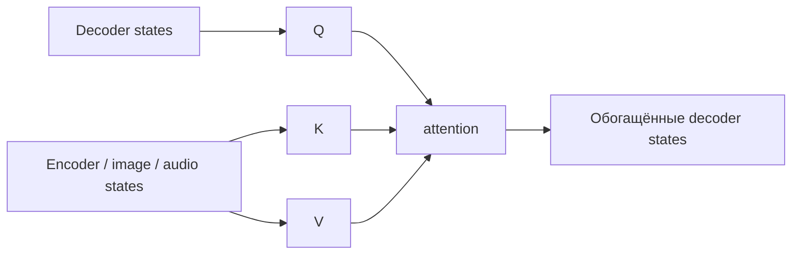

# Cross-Attention

В **cross-attention** queries приходят из одной последовательности, а keys и values — из другой:

$$Q=YW_Q,\qquad K=XW_K,\qquad V=XW_V.$$

Например, decoder спрашивает: «какая часть входного предложения нужна для следующего слова?», а encoder предоставляет память.

Cross-attention связывает модальности и подсистемы: текст с изображением, decoder с audio encoder, latent queries с vision features. В отличие от [[02 Areas/ML & DL/01 Справочник/Attention/Self-Attention|self-attention]], длины query и memory могут различаться, поэтому score matrix имеет форму `[n_query, n_memory]`.

Cross-attention — механизм, а не самостоятельный архитектурный класс. Он является центральной частью [[02 Areas/ML & DL/01 Справочник/Архитектурные паттерны/Encoder-Decoder|Encoder–Decoder]], но может добавляться и в decoder-only backbone.

## Источники

- [Attention Is All You Need](https://arxiv.org/abs/1706.03762)
- [[02 Areas/ML & DL/Concepts/NLP/Cross-Attention|Legacy: Cross-Attention]]
