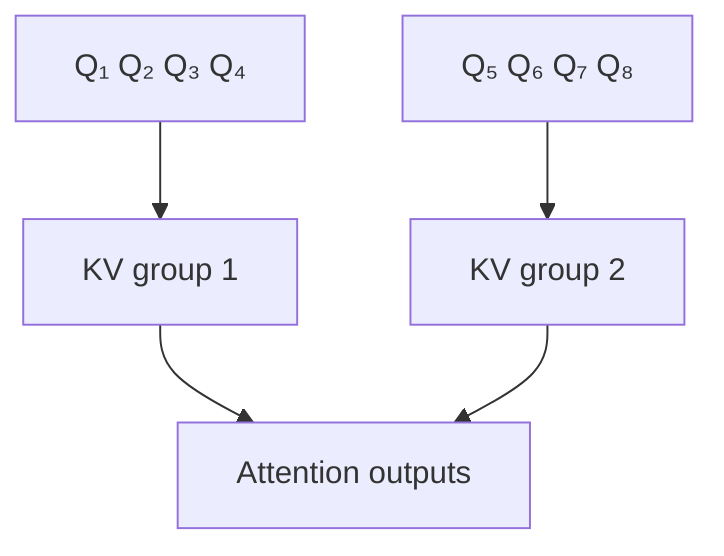

# Grouped-Query Attention (GQA)

**GQA** группирует query-heads: каждая группа использует общий K-head и V-head. Это компромисс между [[02 Areas/ML & DL/01 Справочник/Attention/MHA|MHA]] и [[02 Areas/ML & DL/01 Справочник/Attention/MQA|MQA]].

Если query-heads `h_q=32`, а KV-heads `h_kv=8`, каждые четыре query-heads делят K/V. KV-cache примерно в четыре раза меньше, чем у MHA с 32 KV-heads, но богаче, чем MQA с одной.

GQA особенно важно для serving: autoregressive decode часто memory-bandwidth-bound, и уменьшение cache ускоряет обработку токена. Число KV-heads — архитектурный гиперпараметр, а не свойство training objective.

GQA используется во многих современных decoder-only семействах. Наличие GQA следует проверять по paper/model config конкретного релиза.

## Источники

- [GQA: Training Generalized Multi-Query Transformer Models from Multi-Head Checkpoints](https://arxiv.org/abs/2305.13245)
- [[02 Areas/ML & DL/Concepts/Architectures/GQA|Legacy: GQA]]
