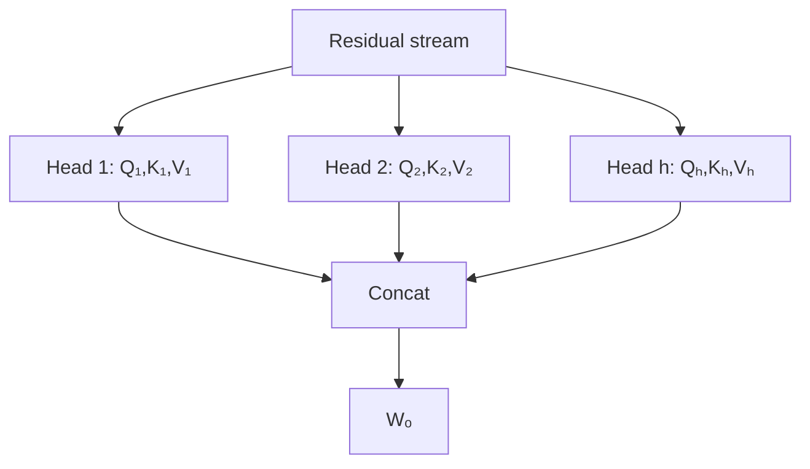

# Multi-Head Attention (MHA)

**MHA** выполняет attention параллельно в нескольких подпространствах:

$$\operatorname{MHA}(X)=\operatorname{Concat}(head_1,\dots,head_h)W_O.$$

Каждая голова имеет собственные проекции Q, K и V. При $d_{model}=h\,d_{head}$ формы обычно `[batch, heads, seq, d_head]`.

Разные головы могут научиться разным паттернам, но явное человеческое значение каждой головы не гарантируется. Для autoregressive inference MHA хранит отдельные K/V каждой головы; размер [[02 Areas/ML & DL/01 Справочник/Inference/KV-cache|KV-cache]] растёт примерно линейно с числом KV-heads и длиной контекста.

Эту цену уменьшают [[02 Areas/ML & DL/01 Справочник/Attention/MQA|MQA]], [[02 Areas/ML & DL/01 Справочник/Attention/GQA|GQA]] и [[02 Areas/ML & DL/01 Справочник/Attention/MLA|MLA]].

## Источники

- [Attention Is All You Need](https://arxiv.org/abs/1706.03762)
