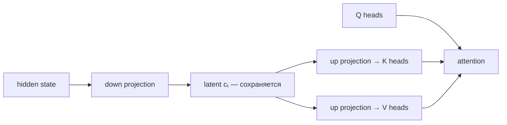

# Multi-head Latent Attention (MLA)

**MLA** сжимает информацию, необходимую для keys и values, в низкоразмерный latent-вектор, который можно сохранить вместо полного набора K/V. Механизм представлен в DeepSeek-V2.

В упрощённом виде:

$$c_t^{KV}=W^{DKV}h_t,\qquad k_t=W^{UK}c_t^{KV},\qquad v_t=W^{UV}c_t^{KV}.$$

На практике детали сложнее: MLA совместно проектирует KV, отдельно обрабатывает RoPE-зависимую часть key/query и использует матричное поглощение проекций при inference. Главная идея остаётся: cache хранит компактное представление.

## Отличие от GQA

- GQA уменьшает **число KV-heads**.
- MLA уменьшает **размер сохраняемого состояния через low-rank latent**.

Оба подхода уменьшают KV-cache, но их параметризация и inference kernels различаются. MLA нельзя описывать просто как «ещё меньше KV-heads».

## Trade-offs

Преимущество — сильное уменьшение cache при сохранении богатых head-specific представлений после реконструкции. Цена — более сложная реализация, kernel optimization и взаимодействие с positional encoding.

## Источники

- [DeepSeek-V2](https://arxiv.org/abs/2405.04434)
- [[02 Areas/ML & DL/Concepts/Training/Multi-head Latent Attention|Legacy: MLA]]
