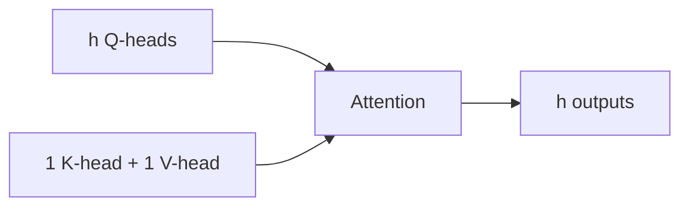

# Multi-Query Attention (MQA)

**MQA** оставляет много query-heads, но делит одну пару K/V между ними.

При decode модель читает существенно меньше данных из KV-cache. Если MHA хранит `h` наборов K/V, MQA — один; это снижает память и bandwidth, которые часто ограничивают генерацию.

Trade-off: одна общая KV-память менее выразительна, и качество может снижаться. [[02 Areas/ML & DL/01 Справочник/Attention/GQA|GQA]] занимает промежуточную точку: несколько KV-heads вместо одного.

Важно: query-heads не исчезают. Экономия относится именно к K/V и особенно заметна на длинном контексте и больших batch при serving.

## Источники

- [Fast Transformer Decoding: One Write-Head is All You Need](https://arxiv.org/abs/1911.02150)
