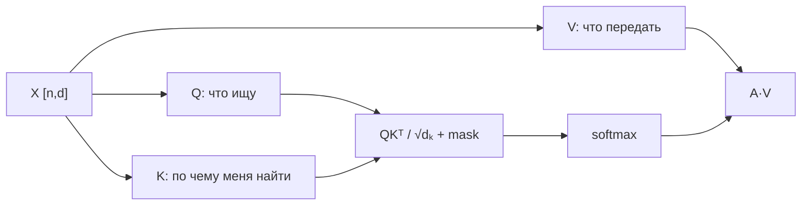

# Self-Attention

**Self-attention** позволяет каждому токену собрать контекст из той же последовательности. Из входа $X\in\mathbb{R}^{n\times d}$ строятся:

$$Q=XW_Q,\quad K=XW_K,\quad V=XW_V,$$
$$A=\operatorname{softmax}\left(\frac{QK^\top}{\sqrt{d_k}}+M\right),\quad O=AV.$$

Матрица $A$ имеет форму `[n_query, n_key]`: каждая строка — распределение внимания одной позиции по доступным ключам. Деление на $\sqrt{d_k}$ удерживает logits в масштабе, при котором softmax не насыщается слишком быстро.

Mask определяет паттерн доступа: causal mask разрешает только прошлое; padding mask скрывает пустые позиции; local/sparse mask ограничивает область связи.

Self-attention не является «объяснением решения» модели: attention weights показывают маршрут смешивания values в конкретной голове, но не исчерпывают причинность всей сети.

## Варианты

[[02 Areas/ML & DL/01 Справочник/Attention/MHA|MHA]], [[02 Areas/ML & DL/01 Справочник/Attention/MQA|MQA]], [[02 Areas/ML & DL/01 Справочник/Attention/GQA|GQA]] и [[02 Areas/ML & DL/01 Справочник/Attention/MLA|MLA]] по-разному организуют головы и сохранение K/V.

## Источники

- [Attention Is All You Need](https://arxiv.org/abs/1706.03762)
- [[02 Areas/ML & DL/Concepts/NLP/Self-Attention|Legacy: Self-Attention]]
