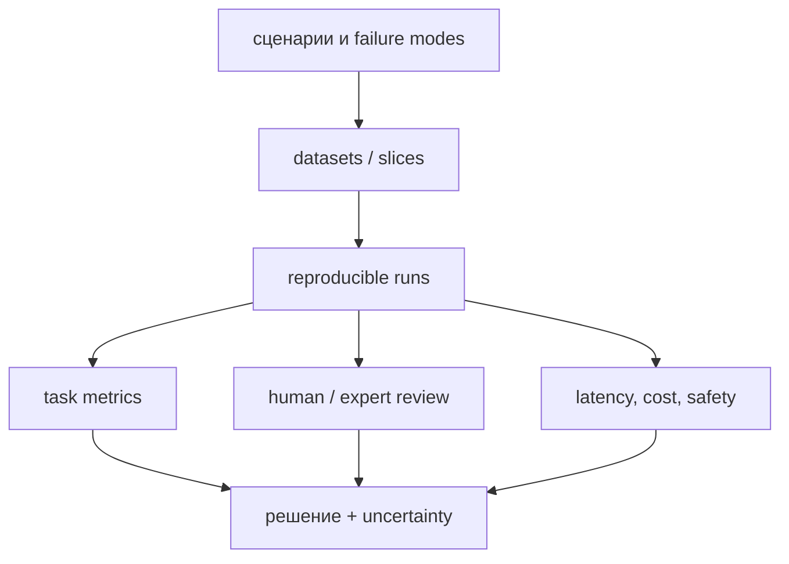

# Evaluation LLM-систем

Evaluation — не один benchmark score, а доказательство того, что система выполняет нужные задачи при известных ограничениях.

## Слои оценки

- **Capability:** знания, reasoning, coding, multilingual.
- **Task quality:** точность на реальном distribution.
- **System:** retrieval, tool use, citations, robustness.
- **Safety:** harmful outputs, privacy, prompt injection.
- **Operations:** latency, throughput, cost, reliability.

## Методика

1. До эксперимента определить decision и acceptance criteria.
2. Разделить test set на важные slices и failure modes.
3. Зафиксировать prompt, decoding, model version и tools.
4. Сообщать uncertainty: bootstrap CI или повторные runs.
5. Проверять contamination и leakage.
6. Для LLM-as-a-judge измерять agreement с людьми, position/verbosity/style bias и использовать blind pairwise setup.
7. Сохранять примеры ошибок, а не только среднее.

Automatic metrics полезны, если соответствуют задаче: exact match, F1, pass@k, BLEU/ROUGE, Recall@k, nDCG. Ни одна из них не является универсальной метрикой «качества LLM».

## Benchmark caveats

MMLU и подобные наборы удобны для истории и сравнения, но страдают saturation, contamination, форматными эффектами и не отражают production workflow. Нельзя переносить небольшую разницу leaderboard на продукт без task-specific eval.

## Источники

- [HELM](https://arxiv.org/abs/2211.09110)
- [MMLU](https://arxiv.org/abs/2009.03300)
- [lm-evaluation-harness](https://github.com/EleutherAI/lm-evaluation-harness)
- [[02 Areas/ML & DL/Concepts/Evaluation/_index|Legacy: Evaluation]]
