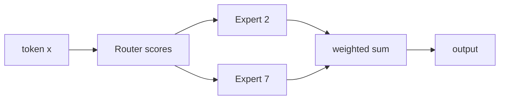

# Mixture of Experts (MoE)

**Sparse MoE** заменяет dense FFN набором экспертов и router, который для каждого токена выбирает небольшое число экспертов.

$$y=\sum_{i\in TopK(g(x))}p_i(x)\,E_i(x).$$

Это разделяет **total parameters** и **active parameters**: модель может иметь большой capacity, но вычислять только top-k экспертов на токен.

## Главные сложности

- баланс нагрузки: без auxiliary loss часть экспертов перегружается, другие не учатся;
- capacity и dropped/rerouted tokens;
- all-to-all communication между accelerators;
- routing instability и сложность serving;
- память всё равно должна хранить параметры всех экспертов.

Shared experts (например, в DeepSeekMoE) всегда активны и захватывают общие знания; routed experts специализируются. Fine-grained expert segmentation меняет гранулярность маршрутизации.

MoE — архитектурный механизм FFN, а не ансамбль независимо обученных моделей и не синоним «нескольких агентов».

## Источники

- [Outrageously Large Neural Networks](https://arxiv.org/abs/1701.06538)
- [Switch Transformers](https://arxiv.org/abs/2101.03961)
- [DeepSeekMoE](https://arxiv.org/abs/2401.06066)
- [[02 Areas/ML & DL/Concepts/Architectures/MoE|Legacy: MoE]]
