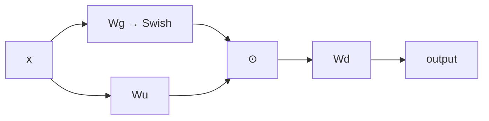

# SwiGLU

**SwiGLU** — gated feed-forward layer. Одна проекция создаёт содержимое, другая — gate:

$$\operatorname{SwiGLU}(x)=
\big(\operatorname{Swish}(xW_g)\odot xW_u\big)W_d,$$
$$\operatorname{Swish}(z)=z\,\sigma(z).$$

FFN применяется независимо к каждой позиции; смешивание токенов делает attention. Gate позволяет входно-зависимо регулировать пропускание признаков, а не только применять фиксированную ReLU/GELU.

Из-за двух входных проекций hidden width часто выбирают меньше классического `4·d_model`, чтобы сопоставить число параметров. Точные размеры являются гиперпараметрами модели.

SwiGLU — **dense FFN**: для каждого токена активируются все её параметры. [[02 Areas/ML & DL/01 Справочник/FFN и MoE/Mixture of Experts|MoE]] заменяет один dense FFN банком экспертов с маршрутизацией.

## Источники

- [GLU Variants Improve Transformer](https://arxiv.org/abs/2002.05202)
- [LLaMA](https://arxiv.org/abs/2302.13971)
