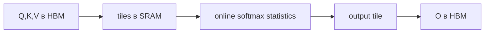

# FlashAttention

**FlashAttention** вычисляет exact scaled dot-product attention, не материализуя целиком матрицу attention в медленной HBM-памяти. Он разбивает Q/K/V на tiles, использует SRAM и online softmax.

Обычная реализация часто записывает и снова читает $n\times n$ score/probability matrices. FlashAttention уменьшает memory I/O — критический bottleneck GPU — и поэтому работает быстрее при меньшем memory footprint.

## Что важно

- результат математически exact с учётом обычной floating-point погрешности, а не sparse approximation;
- асимптотическое число attention FLOPs остаётся квадратичным по длине;
- он не уменьшает размер [[02 Areas/ML & DL/01 Справочник/Inference/KV-cache|KV-cache]] сам по себе;
- поддержка masks, dropout, GQA и hardware зависит от версии/kernel implementation.

FlashAttention-2 улучшил partitioning работы и utilisation GPU. Более новые версии и vendor kernels развивают ту же IO-aware идею; свойства нужно проверять по конкретной реализации.

## Источники

- [FlashAttention](https://arxiv.org/abs/2205.14135)
- [FlashAttention-2](https://arxiv.org/abs/2307.08691)
- [Official repository](https://github.com/Dao-AILab/flash-attention)
- [[02 Areas/ML & DL/Concepts/Inference/Flash Attention|Legacy: Flash Attention]]
