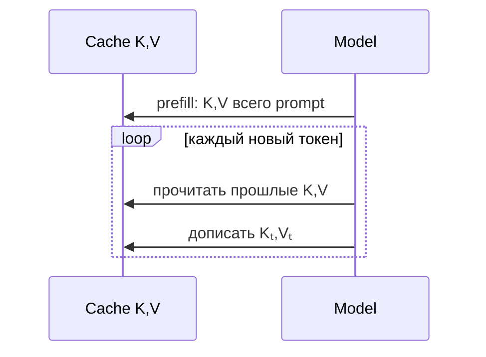

# KV-cache

При autoregressive generation новые queries должны взаимодействовать со всеми прошлыми keys и values. **KV-cache** сохраняет K/V предыдущих токенов, чтобы не пересчитывать весь префикс на каждом decode step.

Для обычного attention объём cache масштабируется приблизительно как:

$$2\cdot L\cdot T\cdot h_{kv}\cdot d_{head}\cdot bytes,$$

где `2` — K и V, `L` — слои, `T` — сохранённые токены. Нужно дополнительно умножить на batch/число sequences.

## Prefill и decode

- **Prefill:** prompt обрабатывается параллельно; обычно compute-intensive.
- **Decode:** добавляется по одному токену; чтение большого cache часто memory-bandwidth-bound.

Именно поэтому [[02 Areas/ML & DL/01 Справочник/Attention/MQA|MQA]], [[02 Areas/ML & DL/01 Справочник/Attention/GQA|GQA]] и [[02 Areas/ML & DL/01 Справочник/Attention/MLA|MLA]] важны для serving.

Paged KV-cache управляет cache блоками и уменьшает fragmentation; prefix caching повторно использует общий prompt; quantized KV снижает память ценой возможной ошибки. Это inference techniques, не изменение уже обученных attention weights.

## Источники

- [Fast Transformer Decoding / MQA](https://arxiv.org/abs/1911.02150)
- [vLLM / PagedAttention](https://arxiv.org/abs/2309.06180)
- [[02 Areas/ML & DL/Concepts/Inference/KV-Cache|Legacy: KV-cache]]
