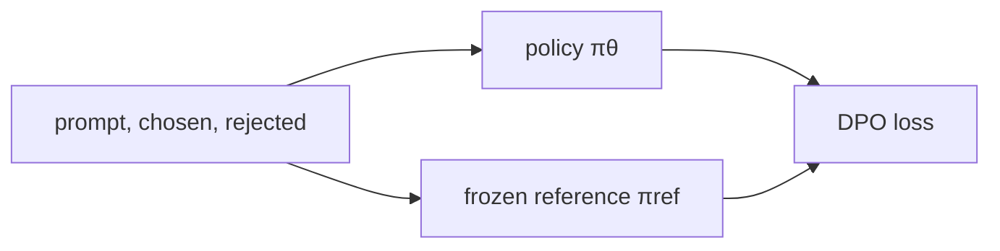

# Direct Preference Optimization (DPO)

**DPO** оптимизирует policy непосредственно на парах предпочтений без отдельного reward-model training и online RL.

$$\mathcal L_{DPO}=
-\log\sigma\left(
\beta\log\frac{\pi_\theta(y^+|x)}{\pi_{ref}(y^+|x)}
-\beta\log\frac{\pi_\theta(y^-|x)}{\pi_{ref}(y^-|x)}
\right).$$

Интуитивно policy должна повысить относительное предпочтение chosen против rejected по сравнению с reference. Параметр $\beta$ регулирует силу отклонения.

## Trade-offs

Плюсы: простой supervised-like loop, нет rollout generation внутри каждого update и отдельной RM. Минусы: качество ограничено offline preference pairs; objective всё равно опирается на модель предпочтений и чувствителен к noise, length bias и coverage данных.

DPO не является drop-in эквивалентом любого RLHF setup: online exploration, verifiable environments и sequence-level credit assignment могут требовать RL-подхода.

## Источники

- [Direct Preference Optimization](https://arxiv.org/abs/2305.18290)
- [[02 Areas/ML & DL/Papers/DPO|Paper note: DPO]]
- [[02 Areas/ML & DL/Concepts/Training/DPO|Legacy: DPO]]
