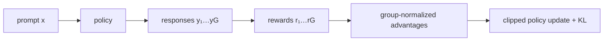

# Group Relative Policy Optimization (GRPO)

**GRPO** — policy optimization method, который для одного prompt сэмплирует группу ответов и строит advantage относительно rewards этой группы, не обучая отдельную value/critic model.

Упрощённая оценка:

$$A_i=\frac{r_i-\operatorname{mean}(r_{1:G})}
{\operatorname{std}(r_{1:G})+\epsilon}.$$

Полный objective включает probability ratios, clipping и обычно KL regularization; детали различаются между реализациями и papers.

## Что решает

Отказ от critic уменьшает память и сложность по сравнению с PPO-style actor-critic. Сравнение внутри группы создаёт baseline для одного prompt.

## Ограничения

Нужны несколько rollouts на prompt; слабая вариативность rewards даёт слабый сигнал; нормализация делает update зависимым от состава группы; остаются off-policy/staleness, reward hacking и stability issues.

GRPO не является синонимом [[02 Areas/ML & DL/01 Справочник/Post-training/RLVR|RLVR]]: это алгоритм оптимизации. RLVR может использовать GRPO, PPO, REINFORCE-подобные методы или иные алгоритмы.

## Источники

- [DeepSeekMath](https://arxiv.org/abs/2402.03300)
- [DeepSeek-R1](https://arxiv.org/abs/2501.12948)
- [[02 Areas/ML & DL/Concepts/Training/GRPO|Legacy: GRPO]]
