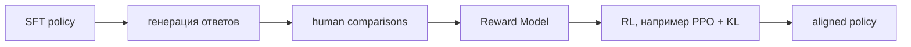

# Reinforcement Learning from Human Feedback (RLHF)

**RLHF** использует человеческие предпочтения как сигнал для оптимизации policy. Классический pipeline:

Policy максимизирует learned reward, обычно со штрафом за удаление от reference policy:

$$\max_\pi\;\mathbb E[r_\phi(x,y)]-\beta D_{KL}(\pi\|\pi_{ref}).$$

KL constraint уменьшает reward hacking и чрезмерный drift, но его сила — trade-off. RLHF может улучшать helpfulness и instruction following, однако preference data субъективны, RM несовершенна, а online RL дорог и нестабилен.

Термин иногда используют широко для всего preference post-training, но строго [[02 Areas/ML & DL/01 Справочник/Post-training/DPO|DPO]] не запускает RL loop и не обучает явную reward model. [[02 Areas/ML & DL/01 Справочник/Post-training/RLVR|RLVR]] использует программно проверяемые rewards вместо или вместе с human feedback.

## Источники

- [Deep RL from Human Preferences](https://arxiv.org/abs/1706.03741)
- [InstructGPT](https://arxiv.org/abs/2203.02155)
- [[02 Areas/ML & DL/Concepts/Training/RLHF|Legacy: RLHF]]
