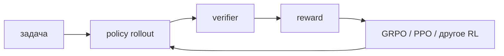

# Reinforcement Learning with Verifiable Rewards (RLVR)

**RLVR** оптимизирует language-model policy с помощью [[02 Areas/ML & DL/01 Справочник/Post-training/Verifiable Reward|проверяемой награды]]: тестов, answer checker, theorem prover или среды.

## Чем отличается от RLHF

| | RLHF | RLVR |
|---|---|---|
| Источник сигнала | человеческие предпочтения → обычно RM | программная/средовая проверка |
| Масштабирование | требует разметки или preference model | дешёвое после создания verifier |
| Хорошо подходит | субъективные качества | математика, код, формальные и tool-задачи |
| Главный риск | reward-model exploitation | verifier/environment exploitation |

RLVR — парадигма reward design, а не конкретный algorithm. [[02 Areas/ML & DL/01 Справочник/Post-training/GRPO|GRPO]] — один из возможных способов обновлять policy.

## Что может выучиться

При достаточном exploration policy может находить более длинные стратегии, self-checking и способы декомпозиции без разметки каждого reasoning step. Однако видимое длинное reasoning не доказывает истинность внутреннего процесса, а успех на закрытых задачах не гарантирует перенос на открытые.

## Дизайн системы

Нужно явно фиксировать: task distribution, sampling, verifier, reward shaping, curriculum, policy algorithm, KL/regularization, contamination и evaluation. Новый paper про RLVR обычно обновляет эти компоненты и исследовательскую линию, а не создаёт «новую архитектуру Transformer».

## Источники

- [DeepSeek-R1](https://arxiv.org/abs/2501.12948)
- [OpenAI: Learning to reason with LLMs](https://openai.com/index/learning-to-reason-with-llms/)
- [[02 Areas/ML & DL/Papers/DeepSeek-R1 Reasoning via RL|Paper note: DeepSeek-R1]]
- [[02 Areas/ML & DL/Concepts/Training/RLVR|Legacy: RLVR]]
