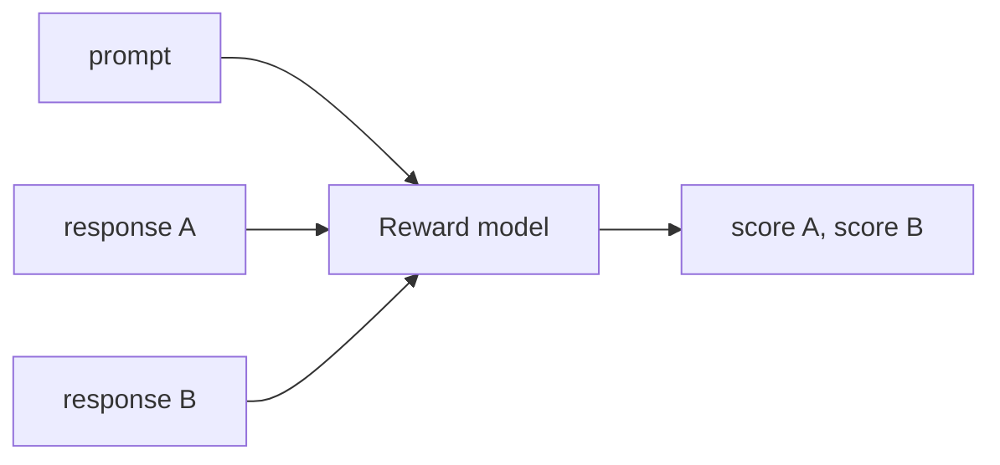

# Reward Model

**Reward model (RM)** присваивает scalar score ответу в контексте запроса. Обычно его учат на предпочтениях `chosen ≻ rejected`:

$$\mathcal L_{RM}=-\log\sigma(r_\phi(x,y^+)-r_\phi(x,y^-)).$$

RM аппроксимирует предпочтения annotators, а не объективную «полезность». Он наследует bias разметки, distribution shift и может давать exploitable ошибки. Когда policy оптимизируется слишком агрессивно, она находит способы увеличить proxy reward без реального улучшения — reward hacking / overoptimization.

Reward может быть outcome-level (за весь ответ) или process-level (за промежуточные шаги). [[02 Areas/ML & DL/01 Справочник/Post-training/Verifiable Reward|Verifiable reward]] отличается тем, что score вычисляется проверяющим правилом/средой и не обязан быть learned model.

## Источники

- [Deep RL from Human Preferences](https://arxiv.org/abs/1706.03741)
- [InstructGPT](https://arxiv.org/abs/2203.02155)
- [[02 Areas/ML & DL/Concepts/Training/Reward Model|Legacy: Reward Model]]
