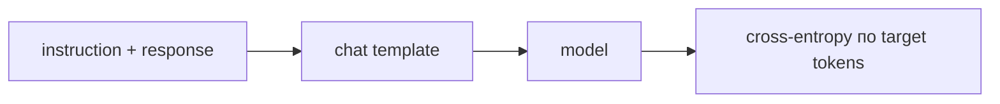

# Supervised Fine-Tuning (SFT)

**SFT** дообучает pretrained model на парах «вход → желаемый ответ» обычным maximum likelihood:

$$\mathcal L_{SFT}=-\sum_t \log\pi_\theta(y_t\mid x,y_{<t}).$$

Loss часто маскируют на prompt tokens, чтобы оптимизировать именно assistant response; конкретный рецепт может обучать и другие части последовательности.

SFT учит формат, стиль, следование инструкциям, tool protocol и новые task patterns. Он не гарантирует factuality или предпочтительность и ограничен качеством demonstrations. Повторное обучение на узком наборе может вызвать forgetting или потерю разнообразия.

SFT обычно предшествует preference optimization / RL, создавая разумную reference policy. Но это практический pipeline, не обязательный закон: возможны direct alignment методы от base model.

## Источники

- [FLAN](https://arxiv.org/abs/2109.01652)
- [InstructGPT](https://arxiv.org/abs/2203.02155)
- [[02 Areas/ML & DL/Concepts/Training/SFT|Legacy: SFT]]
