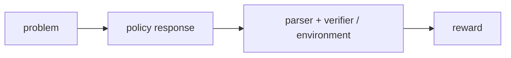

# Verifiable Reward

**Verifiable reward** вычисляется проверяющей процедурой, а не только субъективной оценкой человека или learned reward model. Примеры:

- совпадение математического ответа после корректного parsing;
- прохождение unit tests для кода;
- валидность формального доказательства;
- успешное действие в симуляторе или tool environment.

## Почему это полезно

Сигнал масштабируется автоматически и имеет ясный критерий успеха. Поэтому он удобен для [[02 Areas/ML & DL/01 Справочник/Post-training/RLVR|RLVR]] и обучения reasoning на математике и коде.

## Граница проверяемости

Verifiable не означает «безошибочно» или «соответствует намерению»:

- тесты могут быть неполными;
- parser может ошибаться;
- модель может exploit-ить среду;
- правильный final answer не гарантирует корректный reasoning trace;
- многие качества — полезность, стиль, безопасность — не сводятся к простой проверке.

Outcome reward оценивает конечный результат. Process reward оценивает промежуточные шаги, но требует собственного источника достоверности. Verifier может быть программой, моделью, человеком или их комбинацией; степень объективности нужно указывать явно.

## Источники

- [DeepSeek-R1](https://arxiv.org/abs/2501.12948)
- [Let’s Verify Step by Step](https://arxiv.org/abs/2305.20050)
