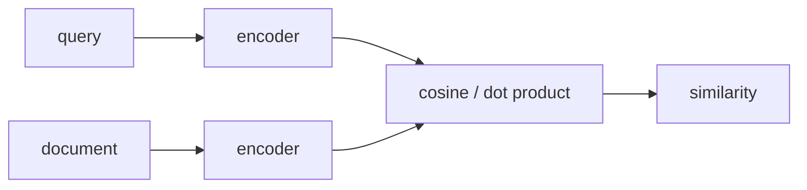

# Embeddings

**Embedding** — обученное отображение дискретного или сложного объекта в dense vector. Близость векторов должна отражать полезное для задачи сходство.

## Три разных значения

1. **Token embeddings** — строки embedding table внутри языковой модели.
2. **Contextual token embeddings** — представления токенов после Transformer.
3. **Sequence embeddings** — один вектор для предложения, запроса или документа.

Для semantic retrieval часто используют bi-encoder: query и document кодируются независимо, поэтому документы можно индексировать заранее. Contrastive loss сближает positive pairs и отдаляет negatives.

$$s(q,d)=\frac{e_q^\top e_d}{\|e_q\|\|e_d\|}\quad\text{или}\quad e_q^\top e_d.$$

Cosine и dot product эквивалентны для L2-normalized vectors. Выбор similarity должен совпадать с training/model card.

## Ограничения

Один vector сжимает документ и теряет детали; качество зависит от домена, языка, pooling, instruction prefix и negatives. Dense embeddings плохо гарантируют exact keyword match, поэтому [[02 Areas/ML & DL/01 Справочник/Retrieval/Retrieval|hybrid retrieval]] сочетает dense и sparse сигналы.

## Источники

- [word2vec](https://arxiv.org/abs/1301.3781)
- [Sentence-BERT](https://arxiv.org/abs/1908.10084)
- [[02 Areas/ML & DL/Concepts/NLP/Word2Vec|Legacy: Word2Vec]]
