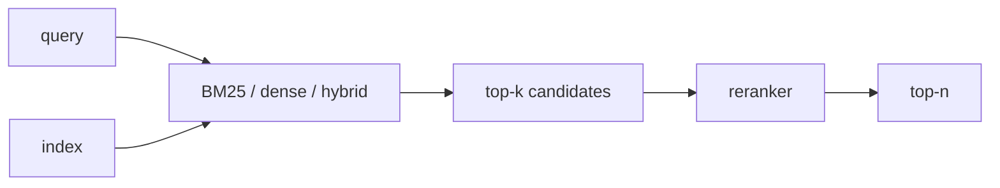

# Retrieval

**Retrieval** выбирает из корпуса кандидатов, релевантных запросу. Практический pipeline разделяет быстрый recall и дорогой precision.

## Подходы

| Метод | Сильная сторона | Слабая сторона |
|---|---|---|
| Sparse (BM25) | точные слова, редкие термины | слабее семантические перефразы |
| Dense bi-encoder | семантическое сходство, быстрый ANN | compression loss, domain shift |
| Late interaction (ColBERT) | token-level matching | индекс больше и поиск сложнее |
| Cross-encoder reranker | высокая точность пары query-document | нельзя дёшево применить ко всему корпусу |
| Hybrid | объединяет lexical и semantic | fusion и calibration требуют настройки |

ANN-индекс ускоряет nearest-neighbor search ценой approximation. Метрики retrieval оценивают, попал ли релевантный документ в кандидаты: Recall@k, MRR, nDCG. Offline relevance не заменяет end-to-end оценку [[02 Areas/ML & DL/01 Справочник/Retrieval/RAG|RAG]].

Chunking является частью index design: размер, overlap и границы определяют, что именно система способна вернуть. Bigger chunks дают контекст, smaller chunks — точность и больше кандидатов.

## Источники

- [Dense Passage Retrieval](https://arxiv.org/abs/2004.04906)
- [ColBERT](https://arxiv.org/abs/2004.12832)
- [[02 Areas/ML & DL/Concepts/Retrieval/Dense Retrieval|Legacy: Dense Retrieval]]
