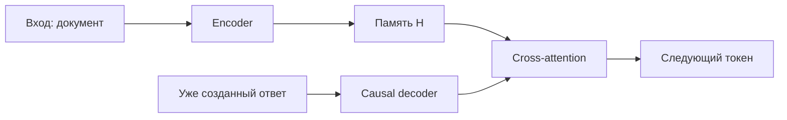

# Encoder–Decoder

**Encoder–Decoder** разделяет задачу на понимание входа и генерацию выхода. Encoder двунаправленно кодирует источник; decoder авторегрессивно создаёт результат и обращается к encoder через [[02 Areas/ML & DL/01 Справочник/Attention/Cross-Attention|cross-attention]].

## Где полезен

Паттерн естественно соответствует задачам «одна последовательность → другая»: перевод, суммаризация, распознавание речи, исправление и преобразование текста. T5 унифицировал многие NLP-задачи как text-to-text.

## Trade-offs

Плюс: источник кодируется один раз, а decoder получает явную память входа. Это особенно удобно, когда вход и выход выполняют разные роли. Минус: два стека параметров и более сложная serving-система, чем у decoder-only.

## Не путать

- Seq2Seq существовал до Transformer на RNN/LSTM.
- Архитектура не определяет objective: возможны denoising, translation, supervised task training.
- Prefix-LM может имитировать двунаправленный источник в одном стеке, но это иной mask pattern.

## Источники

- [Attention Is All You Need](https://arxiv.org/abs/1706.03762)
- [T5](https://arxiv.org/abs/1910.10683)
- [[02 Areas/ML & DL/Concepts/Architectures/Encoder-Decoder|Legacy: Encoder–Decoder]]
