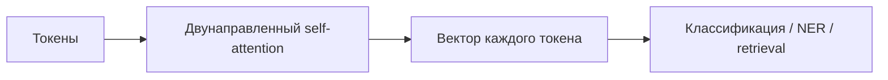

# Encoder-only

**Encoder-only Transformer** превращает всю входную последовательность в контекстуализированные представления. Каждый токен может смотреть на токены слева и справа, поэтому паттерн особенно удобен для понимания уже данного текста.

## Механика

Вход `[batch, seq, d_model]` проходит через стек одинаковых encoder-блоков. В каждом блоке:

1. self-attention без causal mask смешивает информацию между всеми доступными позициями;
2. position-wise FFN преобразует каждый токен;
3. residual connections и normalization стабилизируют глубокую сеть.

После последнего слоя используют представление специального токена, pooling либо все token embeddings.

## Обучение и применение

Классический пример — BERT с masked language modeling: модель восстанавливает скрытые токены, пользуясь обоими контекстами. Encoder-only модели применяют для классификации, извлечения сущностей, reranking и построения [[02 Areas/ML & DL/01 Справочник/Retrieval/Embeddings|эмбеддингов]].

## Ограничение

Двунаправленный attention не задаёт естественного авторегрессивного процесса генерации. Encoder можно приспособить к генерации, но decoder-only или [[02 Areas/ML & DL/01 Справочник/Архитектурные паттерны/Encoder-Decoder|Encoder–Decoder]] обычно подходят лучше.

## Не путать

`Encoder-only` — архитектурный паттерн, а `masked language modeling` — objective обучения. Они часто встречаются вместе, но логически не тождественны.

## Источники

- [BERT](https://arxiv.org/abs/1810.04805)
- [[02 Areas/ML & DL/Concepts/Architectures/Encoder-only|Legacy: Encoder-only]]
