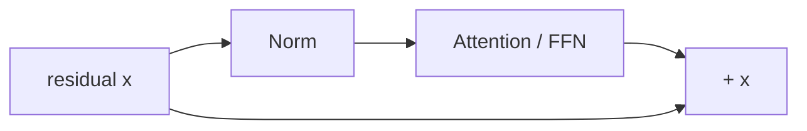

# Нормализация в Transformer

Нормализация контролирует масштаб активаций и помогает обучать глубокие residual-сети. Для токена $x\in\mathbb{R}^d$:

$$\operatorname{LayerNorm}(x)=\gamma\odot\frac{x-\mu}{\sqrt{\sigma^2+\epsilon}}+\beta,$$
$$\operatorname{RMSNorm}(x)=\gamma\odot\frac{x}{\sqrt{\frac1d\sum_i x_i^2+\epsilon}}.$$

RMSNorm не вычитает среднее и обычно не использует bias, поэтому вычислительно проще. Это не означает, что она универсально лучше; это архитектурный выбор, подтверждаемый экспериментом.

## Pre-Norm и Post-Norm

- **Post-Norm:** `Norm(x + Sublayer(x))` — original Transformer.
- **Pre-Norm:** `x + Sublayer(Norm(x))` — облегчает путь градиента по residual stream и широко используется в LLM.

Расположение norm и вид norm — два разных решения. Также существуют sandwich norm, QK-normalization и другие локальные стабилизаторы.

Normalization считается по feature dimension каждого токена и не зависит от batch statistics, в отличие от BatchNorm.

## Источники

- [Layer Normalization](https://arxiv.org/abs/1607.06450)
- [RMSNorm](https://arxiv.org/abs/1910.07467)
- [[02 Areas/ML & DL/Concepts/NLP/Layer Normalization|Legacy: Layer Normalization]]
