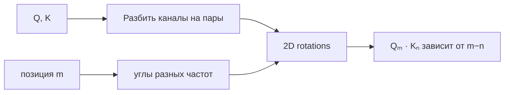

# Rotary Position Embedding (RoPE)

**RoPE** кодирует позицию, поворачивая пары координат query и key на угол, зависящий от позиции. Оно не добавляет position vector к hidden state, а изменяет геометрию dot product.

Для пары координат:

$$R_m(\theta)=
\begin{bmatrix}
\cos m\theta & -\sin m\theta\\
\sin m\theta & \cos m\theta
\end{bmatrix}.$$

Ключевое свойство: внутреннее произведение повёрнутых Q и K зависит от относительного смещения позиций. Values обычно не вращаются.

## Длинный контекст

RoPE не гарантирует хорошую экстраполяцию далеко за training length. Расширения контекста меняют частоты или масштаб позиции: position interpolation, NTK-aware scaling, YaRN и другие методы. Их нельзя считать одним стандартным «RoPE scaling»: проверяйте рецепт конкретной модели.

## Trade-offs

RoPE прост, не требует learned position table и хорошо интегрируется с attention. Однако выбор base/frequencies и extrapolation recipe влияет на качество длинного контекста; неправильное scaling может ухудшить короткие и длинные зависимости.

## Источники

- [RoFormer: Enhanced Transformer with Rotary Position Embedding](https://arxiv.org/abs/2104.09864)
- [[02 Areas/ML & DL/Concepts/Architectures/RoPE|Legacy: RoPE]]
