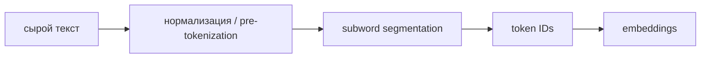

# Токенизация

**Токенизатор** обратимо преобразует текст в последовательность integer IDs из конечного словаря. Затем embedding table отображает ID в векторы.

## Основные семейства

| Подход | Как строит словарь | Характерная черта |
|---|---|---|
| BPE | итеративно объединяет частые пары | детерминированный список merges |
| WordPiece | выбирает объединения по языковой модели/score | известен по BERT |
| Unigram | начинает с большого словаря и удаляет элементы | вероятностные сегментации |
| byte-level BPE | базовый алфавит — 256 байтов | любой Unicode текст представим |

SentencePiece — библиотека, способная обучать BPE или Unigram прямо на raw text; это не четвёртый алгоритм сегментации.

## Почему выбор важен

Tokenizer определяет effective context length, стоимость, скорость и то, насколько удобно модели представлять разные языки, код, числа и редкие символы. Большой словарь сокращает последовательность, но увеличивает embedding/output matrices. Малый словарь делает обратное.

Special tokens задают протокол модели (`BOS`, `EOS`, роли чата, tool boundaries). Изменение словаря после pre-training требует согласованно менять embeddings и обычно дообучать модель.

## Типичные ошибки

- токен не обязан совпадать со словом или морфемой;
- длина в символах не предсказывает длину в токенах;
- «SentencePiece tokenizer» недостаточно точно: нужно знать модель BPE/Unigram и normalization;
- декодирование IDs может быть обратимым, но отображение текста в IDs зависит от normalization и специальных правил.

## Источники

- [Neural Machine Translation of Rare Words with Subword Units](https://arxiv.org/abs/1508.07909)
- [SentencePiece](https://arxiv.org/abs/1808.06226)
- [Karpathy: minbpe](https://github.com/karpathy/minbpe)
- [[02 Areas/ML & DL/Concepts/NLP/Tokenization|Legacy: Tokenization]]
