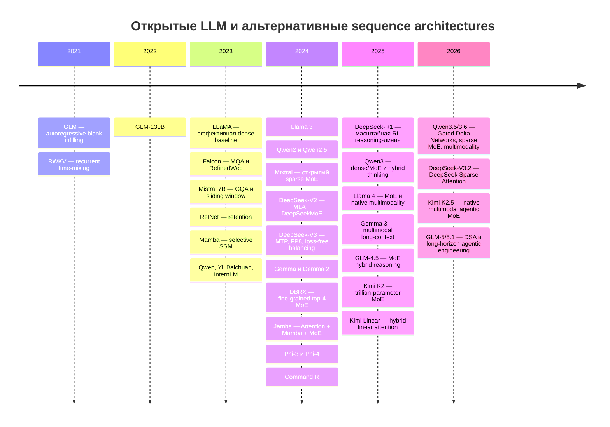

# Timeline архитектур LLM

Даты относятся к публикации идеи или первому заметному открытому релизу.
Timeline показывает **появление линий**, а не утверждает приоритет во всех
деталях.

## Что на timeline не видно

История не является прямой гонкой поколений:

- MHA → MQA/GQA/MLA — линия памяти inference;
- dense → MoE — линия условной вычислительной ёмкости;
- full attention → local/linear/SSM/retention — линия сложности по длине;
- SFT → preference optimization → RLVR — линия post-training;
- text → native multimodality — линия представления входов.

Поэтому новый paper добавляется сначала в соответствующую **линию**, а не
автоматически объявляется новым поколением всей архитектуры.

## Контрольные первоисточники

- [Transformer](https://arxiv.org/abs/1706.03762)
- [LLaMA](https://arxiv.org/abs/2302.13971)
- [Mistral 7B](https://arxiv.org/abs/2310.06825)
- [Mamba](https://arxiv.org/abs/2312.00752)
- [DeepSeek-V2](https://arxiv.org/abs/2405.04434)
- [Jamba](https://arxiv.org/abs/2403.19887)
- [DeepSeek-R1](https://arxiv.org/abs/2501.12948)
- [Qwen3](https://qwenlm.github.io/blog/qwen3/)
- [Qwen3.6](https://github.com/QwenLM/Qwen3.6)
- [DeepSeek-V3.2](https://arxiv.org/abs/2512.02556)
- [Kimi K2.5](https://github.com/MoonshotAI/Kimi-K2.5)
- [GLM-5/5.1](https://github.com/zai-org/GLM-5)

← [[02 Areas/ML & DL/02 Атлас моделей/_index|К атласу]]
