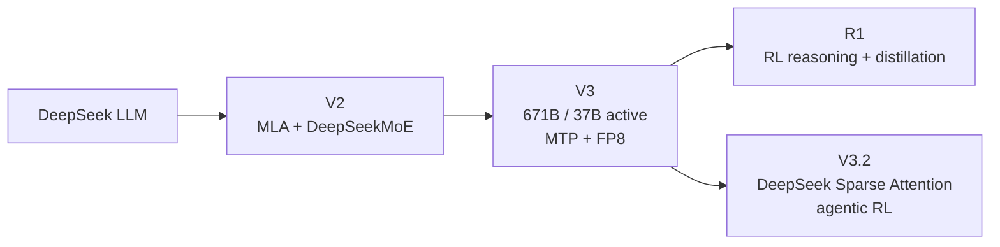

# DeepSeek

## Главный diff

DeepSeek — линия совместного проектирования архитектуры, обучения и inference.
V2 объединяет **MLA** (сжатое latent-представление K/V) и DeepSeekMoE; V3
добавляет auxiliary-loss-free balancing, multi-token prediction и FP8 training.
R1 — прежде всего post-training/reasoning-линия поверх V3-подобной базы, а не
новый тип Transformer. V3.2 добавляет DeepSeek Sparse Attention для снижения
стоимости длинного контекста и масштабирует agentic RL.

## Разделение слоёв

- **Architecture:** MLA, routed/shared experts, MoE (**A**).
- **Pre-training:** 14.8T tokens у V3, FP8 mixed precision, MTP objective (**A**).
- **Post-training:** SFT + RL; R1-Zero показывает RL без предварительного SFT,
  R1 использует многоступенчатый pipeline и distillation (**A**).
- **Inference:** MLA уменьшает KV-cache; MoE требует хранить 671B параметров,
  хотя на токен активируются 37B.

## Primary sources

- [DeepSeek-V2 paper](https://arxiv.org/abs/2405.04434) — **A**
- [DeepSeek-V3 report and code](https://github.com/deepseek-ai/DeepSeek-V3) — **A**
- [DeepSeek-R1 paper](https://arxiv.org/abs/2501.12948) — **A**
- [DeepSeek-V3.2 paper](https://arxiv.org/abs/2512.02556) — **A**
- [DeepSeek-V3.2 experimental code](https://github.com/deepseek-ai/DeepSeek-V3.2-Exp) — **A/B**
