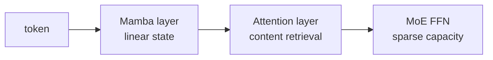

# Jamba

Jamba соединяет Transformer attention, Mamba state-space layers и MoE.
Attention-слои дают content-based retrieval, Mamba — линейное по длине
последовательности обновление состояния, MoE — ёмкость без активации всех весов.

- **Architecture:** hybrid SSM/attention/MoE (**A**).
- **Pre-training:** long-context corpus; детали по release report.
- **Post-training:** instruct и base разделены.
- **Цена:** гибрид сложнее оптимизировать и переносить между inference engines,
  но снижает долю квадратичного attention.

## Primary sources

- [Jamba paper](https://arxiv.org/abs/2403.19887) — **A**
- [Jamba 1.5 announcement](https://www.ai21.com/blog/announcing-jamba-model-family/) — **B**
- [Official model collection](https://huggingface.co/ai21labs) — **A/B**
