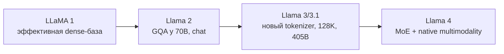

# Llama

## Место в истории

LLaMA закрепила «современный базовый блок»: pre-norm с RMSNorm, RoPE, SwiGLU и
decoder-only Transformer. Поэтому другие семейства удобно описывать как diff
относительно LLaMA.

## Карта поколений

## Что менялось

| Поколение | Architecture | Pre-training | Post-training |
|---|---|---|---|
| LLaMA | MHA, RMSNorm, RoPE, SwiGLU | scaling на public data | base-модели |
| Llama 2 | GQA в 70B | больше данных и контекст | SFT + RLHF |
| Llama 3/3.1 | GQA, 128K у 3.1 | 15T+ tokens, новый tokenizer | instruction + preference |
| Llama 4 | sparse MoE, early-fusion multimodality | text + vision | ассистентские релизы |

**Цена diff:** GQA экономит KV-cache; MoE увеличивает общую ёмкость, но усложняет
routing и распределённый inference. Детали Llama 4 подтверждены официальным
описанием, однако не все training recipe опубликованы (**B**).

## Primary sources

- [LLaMA paper](https://arxiv.org/abs/2302.13971) — **A**
- [Llama 2 paper](https://arxiv.org/abs/2307.09288) — **A**
- [Llama 3 paper](https://arxiv.org/abs/2407.21783) — **A**
- [Llama 4 announcement](https://ai.meta.com/blog/llama-4-multimodal-intelligence/) — **B**
