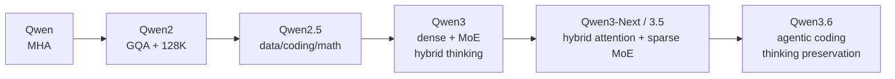

# Qwen

## Diff

Qwen вырос из LLaMA-подобной dense-архитектуры в широкую экосистему dense, MoE,
coder, math и мультимодальных моделей. Qwen2 стандартизировал GQA и длинный
контекст; Qwen2.5 улучшил данные и специализированные ветки; Qwen3 совместил
dense и MoE-модели и переключаемые thinking/non-thinking режимы. Qwen3-Next и
Qwen3.5 перешли к ultra-sparse MoE и hybrid architecture с Gated Delta Networks;
Qwen3.6 развивает эту базу и добавляет thinking preservation для agentic coding.

## Слои изменений

- **Architecture:** GQA; у Qwen3 MoE — 128 experts, 8 активных; варианты
  30B-A3B и 235B-A22B (**A/B**).
- **Pre-training:** рост многоязычных, code/math и long-context данных (**B**).
- **Post-training:** единая модель умеет отвечать быстро или расходовать токены
  на reasoning; это не новый attention-механизм (**B**).
- **Новая hybrid-линия:** Qwen3.5 сочетает Gated Delta Networks со sparse MoE и
  early-fusion multimodal training; для Qwen3.6 пока опираемся на официальный
  repository/blog, а не на peer-style technical report (**B**).
- **Inference:** малое число активных параметров MoE снижает FLOPs, но не объём
  весов и требования к коммуникации.

## Primary sources

- [Qwen technical report](https://arxiv.org/abs/2309.16609) — **A**
- [Qwen2 report](https://arxiv.org/abs/2407.10671) — **A**
- [Qwen2.5 report](https://arxiv.org/abs/2412.15115) — **A**
- [Qwen3 official blog](https://qwenlm.github.io/blog/qwen3/) — **B**, содержит таблицы архитектуры
- [Qwen3.6 and Qwen3.5 official repository](https://github.com/QwenLM/Qwen3.6) — **B**
