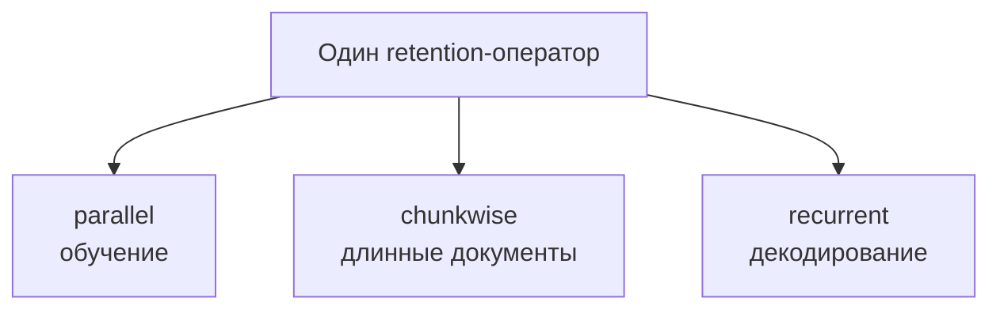

# RetNet

RetNet заменяет self-attention **multi-scale retention** и допускает три режима:
parallel для обучения, recurrent для O(1) decoding memory и chunkwise recurrent
для длинных последовательностей. Это архитектурная линия, а не одно широко
распространённое семейство чат-моделей.

- **Architecture:** retention с экспоненциальным затуханием разных масштабов
  (**A**).
- **Training:** language-model objective отделён от формы оператора.
- **Inference:** constant-memory recurrence; как и у SSM, прошлое сжимается.
- **Статус:** важная исследовательская ветка; меньше production adoption, чем у
  Transformer/Mamba.

## Primary sources

- [Retentive Network paper](https://arxiv.org/abs/2307.08621) — **A**
- [Official implementation](https://github.com/microsoft/unilm/tree/master/retnet) — **A**
