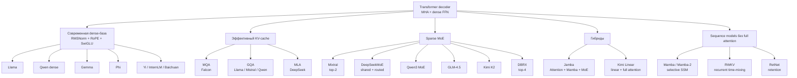

# Карта архитектурных линий

Эта карта отвечает не на вопрос «кто лучше», а на вопрос **где происходит
структурное изменение**. Стрелка означает родство идеи, не наследование весов.

## Три независимые оси

Архитектурные семейства нельзя расположить на одной шкале. У модели одновременно
есть как минимум три независимых выбора:

| Ось | Варианты | Что меняет |
|---|---|---|
| Смешивание токенов | full/local/linear attention, SSM, retention | FLOPs, память и доступ к прошлому |
| FFN/ёмкость | dense, sparse MoE | активные FLOPs против объёма весов |
| Post-training | SFT, preference optimization, RLVR, distillation | поведение, reasoning, tool use |

Например, DeepSeek-R1 — одновременно MoE+MLA на архитектурной оси и RL
reasoning на post-training оси. Называть RL «архитектурой R1» неверно.

## Как сравнивать честно

1. Сравнивать base с base, instruct с instruct.
2. Различать total и active parameters.
3. Не путать максимальный context window с качеством long-context retrieval.
4. Учитывать KV-cache, объём весов и interconnect — не только FLOPs.
5. Фиксировать checkpoint и дату: семейства меняются быстрее учебников.

← [[02 Areas/ML & DL/02 Атлас моделей/_index|К атласу]]
